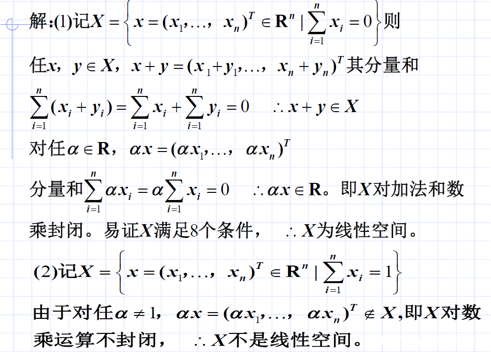
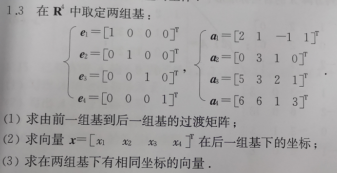
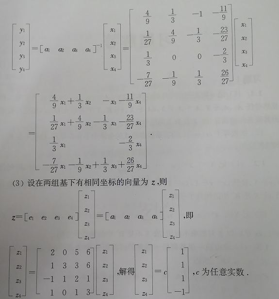
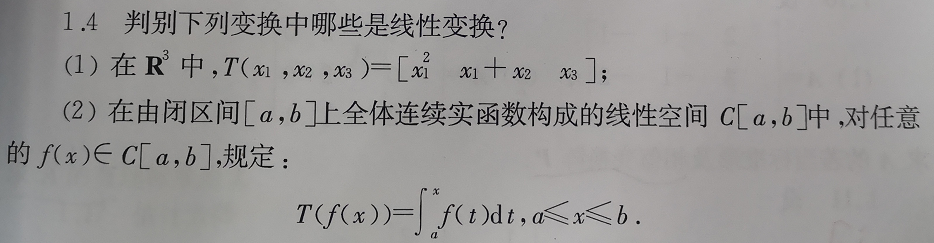
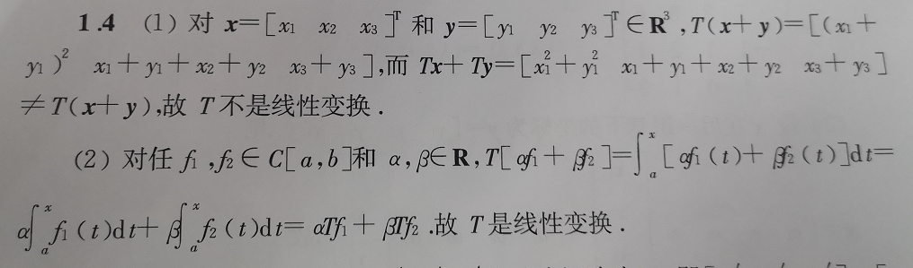

# 管理数学基础
## 第一章 矩阵理论
### 1.0 矩阵理论的产生与发展
### 1.1 线性变换及其矩阵表示
- [是否构成$R$上的线性空间](#010101)
- [基之间的过渡矩阵](#010102)
- [是否是线性变换](#010103)
- [$T$的矩阵表示](#010104)
- [特征值与特征向量](#010105)
- [相似矩阵](#010106)
### 1.2 方阵在相似变换下的标准形
- [方阵的行列式因子、不变因子、初等因子](./notes/0104方阵的行列式因子、不变因子、初等因子.md)
- [方阵相似的条件、若当标准形](./notes/0105方阵相似的条件、若当标准形.md)
### 1.3 方阵特征值的估计
- [方阵特征值估计、圆盘定理、谱与谱半径](./notes/0106方阵特征值估计、圆盘定理、谱与谱半径.md)
### 1.4 矩阵分析
- [矩阵分析、矩阵序列、方阵幂级数、方阵函数](./notes/0107矩阵分析、矩阵序列、方阵幂级数、方阵函数.md)
### 1.5 应用举例
## 第二章 泛函分析
### 2.1 距离空间与巴拿赫不动点定理
- [距离空间及其完备性](./notes/0201距离空间及其完备性.md)
- [压缩映射与巴拿赫不动点定理](./notes/0202压缩映射与巴拿赫不动点定理.md)
### 2.2 线性赋泛空间与有界线性泛函
- [赋泛空间与巴拿赫空间](./notes/0203赋泛空间与巴拿赫空间.md)
- [有界线性算子与泛函、例题](./notes/0204有界线性算子与泛函、例题.md)
### 2.3 泛函的极值
## 第三章 凸分析
### 3.1 凸集与凸集分离定理
- [凸集与凸集分离定理、Farkas引理](./notes/0301凸集与凸集分离定理、Farkas引理.md)
### 3.2 凸函数与次微分
- [凸函数](./notes/0302凸函数.md)
### 3.3 凸函数的极值与凸规划
- [凸函数的极值和凸规划]()
- [最优性的充要条件、无约束极小化问题、一般非线性规划问题]()
## 第四章 模糊数学
### 4.1 模糊集
### 4.2 模糊关系
### 4.3 应用举例
## 第一章部分知识点
### 第一章 矩阵理论（1.1 线性变换及其矩阵表示）
#### 是否构成$R$上的线性空间
<a id="010101" style="color: #800080">是否构成$R$上的线性空间</a>

判断`封闭`：
- $x_1, x_2 \in R$，有$x_1+x_2 \in R$，以及$kx_1 \in R$，其中$k \in R$

如何判断`是否构成X上的线性空间`？由定义：
- 加法运算“+”满足：对$x,y\in X$，$x+y\in X$，且
  - 交换律：$x+y=y+x$
  - 结合律：对任意$z\in X$，$(x+y)+z=x+(y+z)$
  - 有零元：存在$0\in X$，使得对一切$x\in X$，有$x+0=x$（$0$称为$X$的零元素）`这条一般被作为反例，直接用于判断不成立`
  - 有负元：对任意$x\in X$，存在$y\in X$，使$x+y=0$（$y$称为$x$的负元素）
- 数乘元素“·”满足：对任意$\alpha \in K$（$K$为实数域$R$或复数域$C$），$x \in X$，$\alpha x \in X$，且：
  - 对任意的$\beta \in K$，$\alpha (\beta x) = (\alpha \beta)x$
  - $1 \cdot x = x$
  - 对任意的$y \in X$，$\alpha(x + y) = \alpha x + \alpha y$
  - 对任意的$\beta \in K$，$(\alpha + \beta)x = \alpha x + \beta x$

**例题：** 判断下列集合对于所指运算是否为（$R$上的）线性空间（$R^n$的子空间）。
- （1）分量之和等于0的$n$维向量的全体，对向量加和数乘
- （2）分量之和等于1的$n$维向量的全体，对向量加和数乘

**解：**

**分析：**
- 是否封闭？
- 分别满足加法与乘法的四个条件？

#### 基之间的过渡矩阵
<a id="010102" style="color: #800080">基之间的过渡矩阵</a>

$$[\epsilon_1, ...,\epsilon_n] = [\eta_1, ...,\eta_n]P$$

$P$称为$\eta$到$\epsilon$的过渡矩阵。

**例题：**

**解：**
![注：上图中应该是$[a_1 \; a_2 \; a_3 \; a_4]=[a_1 \; e_2 \; e_3 \; e_4]P$](./images/010103.png)

**分析：**
- 由$e$到$a$的过渡矩阵，由$a=eP$定义式可得$P=e^{-1}a$
- 在某一坐标系（基）下的坐标，其`实际`表示的坐标点是$[e_i]_{1\times i}[x]_{i \times 1}$；因此，对于同一坐标点，可以在不同坐标系下建立相等的关系$[e_i]_{1\times i}[x]_{i \times 1} = [a_i]_{1\times i}[y]_{i \times 1}$

#### 是否是线性变换
<a id="010103" style="color: #800080">是否是线性变换</a>

- 映射：$T: X \rightarrow Y$
- 线性映射：线性空间$X$到$Y$满足线性的映射，即$T$满足：$T(\alpha x + \beta y) = \alpha T x + \beta T y$
- 线性变换：$Y=X$时的线性映射，即$T: X\rightarrow X$

**例题：**

**解：**

**分析：**
- 直接套用定义，是否满足$T(\alpha x + \beta y) = \alpha T x + \beta T y$

#### $T$的矩阵表示
<a id="010104" style="color: #800080">$T$的矩阵表示</a>

[Check this link.](./notes/0101T的矩阵表示.md)

#### 特征值与特征向量
<a id="010105" style="color: #800080">特征值与特征向量</a>

[Check this link.](./notes/0102特征值与特征向量.md)

#### 相似矩阵
<a id="010106" style="color: #800080">相似矩阵</a>

[Check this link.](./notes/0103相似矩阵.md)
