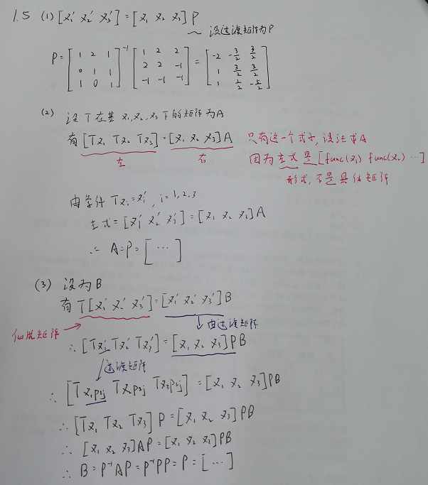

# $T$的矩阵表示
## 线性映射$X\rightarrow Y$, $T\xi = \eta A$
### 定义

**分析：**
- 是`线性映射`，不是`变换`，映射后维度可以不同（$T\xi_{n \times n}=\eta_{m\times m}A_{m\times n}$）
- 具体解释一下，即$\xi$被$T$作用后，是一个新的长度为$m$的向量，而$\xi$本身是长度为$n$的向量
- 这很好理解：因为`空间变`了，从$X$映射到了$Y$
- 如何理解$T$？是一个函数、一个动作，而非一个数

也就是说，这是`映射之所以为映射`，空间都不同了，维度当然有可能不同；下面是在一个空间中的变换，我们称之为`线性变换`。

补充一下：$T\xi$代表，我要对$\xi$`施加一种动作`，但是具体如何做？使用`矩阵乘法`表示。

## 线性变换$X\rightarrow X$, $T\xi = \xi A$
### 定义

**分析：**
- 在同一空间中的的操作
- $A$当然是方阵

## 例题

### 解答

### 分析
- 注意理解 $Tx$ 的意义，是一个`调用函数`的表示，而非具体数值/矩阵
- 因此，要时刻想着利用函数具体是什么，把其转换为能运算的矩阵