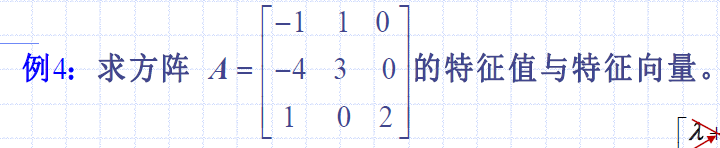
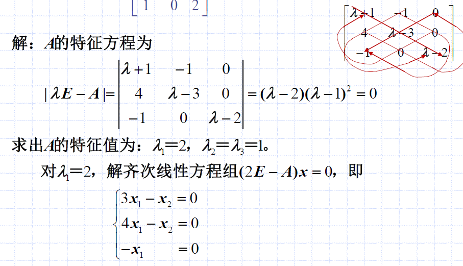
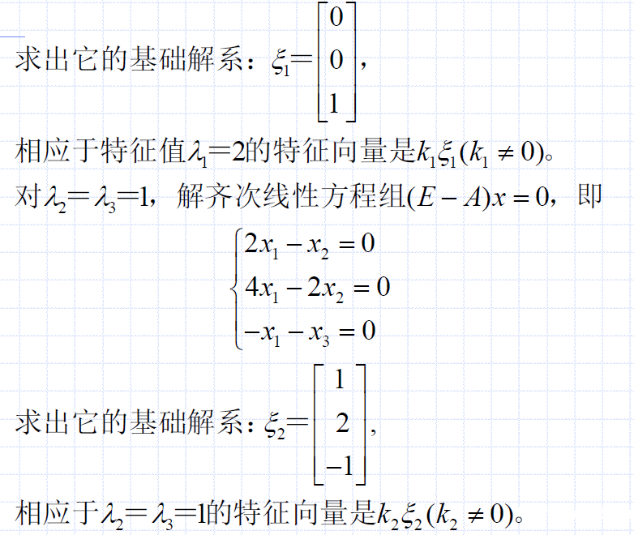
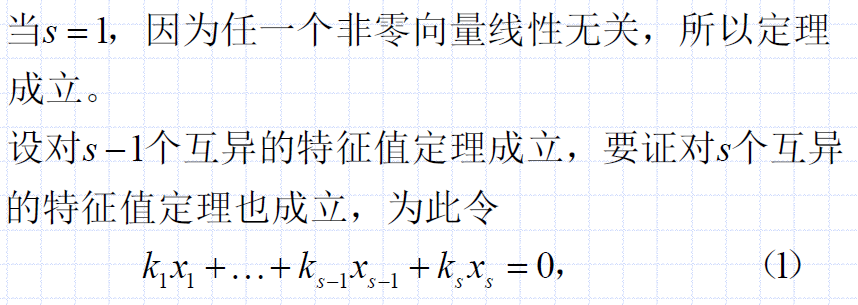
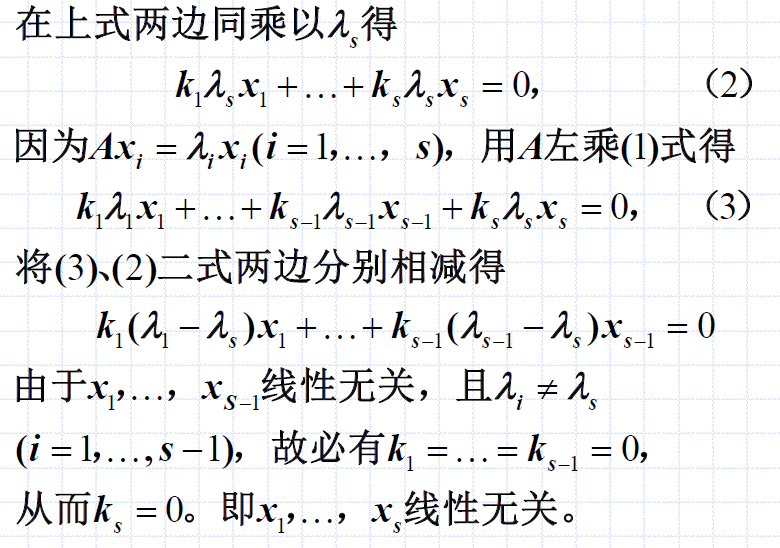

# 特征值与特征向量
## 定义
$$Ax = \lambda x$$

其中：
- $A$为$n$阶方阵，如果$x$为$n$维非零的列向量
- 称数$\lambda$为方阵$A$的一个特征值
- $x$为$\lambda$相应的特征向量

## 特征向量的性值
- 如果$x$是$A$的相应于$\lambda$的特征向量，那么对任意非零数$k$，$kx$也是相应于$\lambda$的特征向量
- 如果$x_1$和$x_2$都是$A$的相应于$\lambda$的特征向量，那么$x_1 + x_2$也是相应于$\lambda$的特征向量

**即对加法和数乘运算封闭。**

## 特征矩阵、特征多项式、特征方程
由$Ax = \lambda x$可得：
$$(\lambda E - A)x = 0$$

由线性代数知：`上述关于x的方程组，有非零解的充要条件是系数行列式等于0`，所以要求$\lambda$满足：
$$|\lambda E - A| = 0$$

有以下定义：
- 特征矩阵：$\lambda E - A$
- 特征多项式：$|\lambda E - A|$
- 特征方程：$|\lambda E - A| = 0$

所以称 $\lambda$ 为 $A$ 的特征方程的根（特征值又称为特征根）。

### 例题

#### 解答

#### 分析
- 先求解特征方程$|\lambda E - A| = 0$
- 分别对每个特征值求特征向量（大概率是用`基础解系`表示）

## 定理：特征向量线性无关
若$\lambda_1,...,\lambda_s$是方阵$A$的互异的特征值，$x_1,...,x_s$是分别相应于它们的特征向量，则$x_1,...,x_s$线性无关。

### 使用数学归纳法证明
分析：
- 证明$x_1,...,x_s$线性无关
- 即证明$k_1 x_1 + ... + k_s x_s = 0$中必有$k_1=...=k_s=0$

现在有了证明目标，使用数学归纳法证明如下。

分析：
- 利用了特征值的性质$Ax_i = \lambda_i x_i$
- 上面的证明过程中，使用(3)减去$\lambda_s$倍的(1)，是为了利用上$x_1,...,x_{s-1}$线性无关的数学归纳假设
- 要注意，虽然$x_1,...,x_{s-1}$线性无关是假设，但不可以直接用$k_1=...=k_{s-1}=0$；因为一共有$s$个$k$，而非是$s-1$项构成的等式；相反，我们要`利用`$x_1,...,x_{s-1}$线性无关`导出`$k_1=...=k_{s-1}=0$
