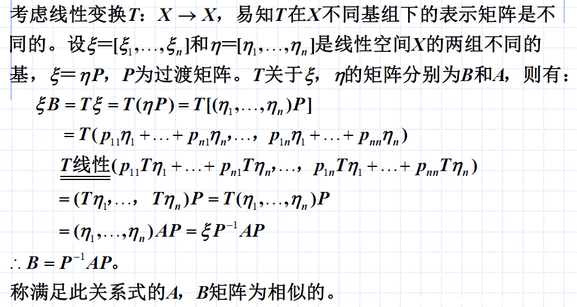
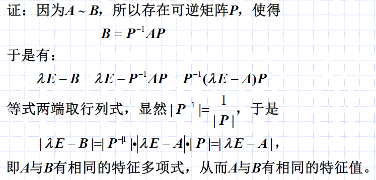

# 相似矩阵
## 定义

分析：
- 值得注意的是，这里的定义刚好与[0101T的矩阵表示的例题](./0101T的矩阵表示.md#例题)对应上了
- 因此我推断：
  - 对于同一线性空间中的两组基 $\xi,\eta$，过渡矩阵为$\xi = \eta P$
  - 同一个线性变换$T$作用在其上，对应的矩阵分别为$B$与$A$
  - 那么，$B$与$A$是相似的，且可以用过渡矩阵建立关系：$B = P^{-1} A P$
- 上述推导过程中大量使用了$\xi B = T \xi$等的关系，以及$T$的性质

因此，可以重新定义`相似矩阵`：设$A$、$B$均为$n$阶方阵，若存在$n$阶可逆矩阵$P$，使得
$$B = P^{-1}AP$$
则称$A$相似于$B$，记为$A\sim B$。这时可称$P^{-1}AP$为对$A$施行相似变换，其中$P$称为相似变换阵。

## 定理：T在X两组基下的表示阵是相似的
设$T$是线性空间上的线性变换，则$T$在$X$两组不同基下的表示阵是相似的。

这个由上面的第一个定义我就分析了。此外，还可以理解为：既然是同一个线性变换，其两个矩阵就应该有相同点（毕竟，用于右乘的矩阵是变换的具体表现$T\xi=\xi B$）。

## 性质
### A与B相似，二者行列式、秩和特征值相同
若$A\sim B$，则$A$与$B$有相同的行列式、秩和特征值。

#### 证明：相同的特征多项式/特征值

分析：
- 利用了 $B=P^{-1}AP$ 、 $\lambda E =P^{-1}\lambda EP$ 、行列式 $|ABC| = |A||B||C|$ 的性质
- 因为特征多项式（行列式）相同，所以特征值相同

#### 证明：相同的行列式
$|B|=|P^{-1}AP|=|P^{-1}||A||P|=|A|$

#### 证明：秩相同
- $A\sim B$
- $A$与$B$拥有全同的初等因子
- $A$与$B$有相同的若当形
- $A$与$B$秩相同

初等因子、若当形这些概念将在下一节笔记中讨论。
