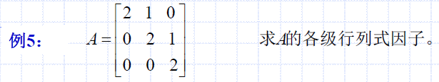
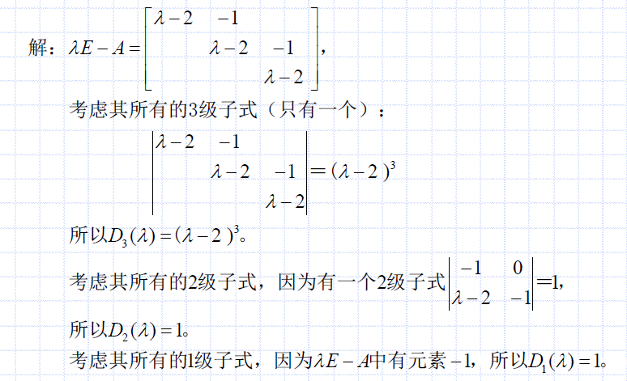
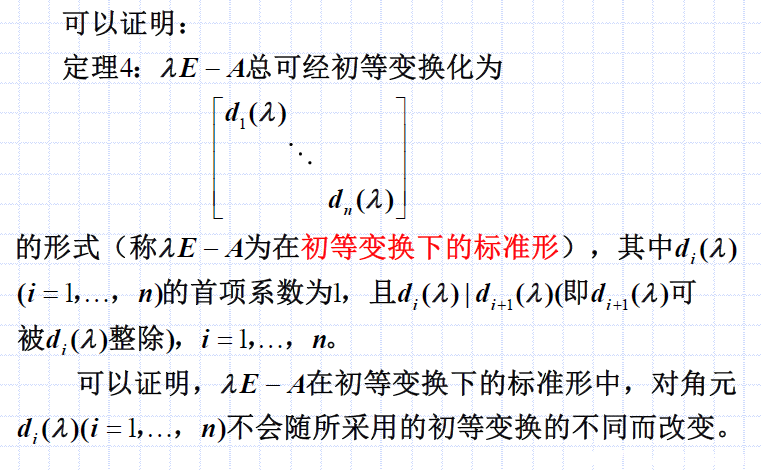
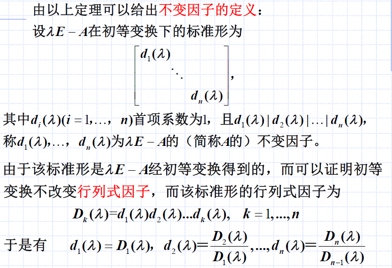
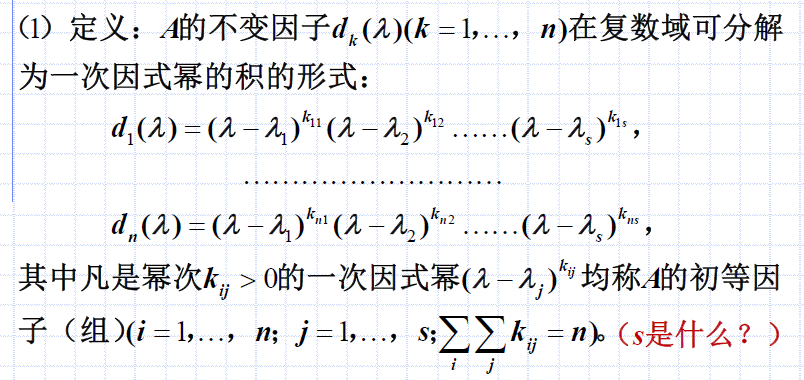
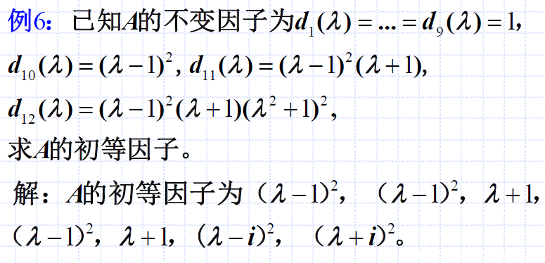
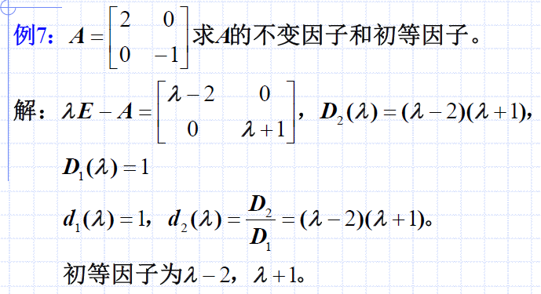
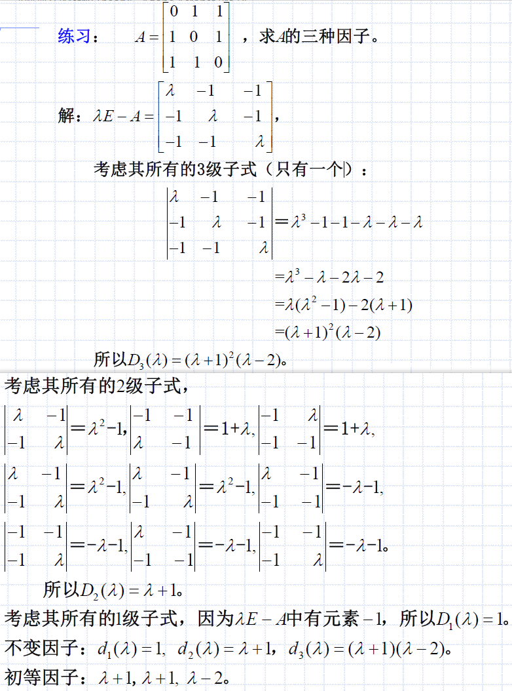

# 方阵的行列式因子、不变因子、初等因子
## 行列式因子
### 直接的定义
$\lambda E - A$中所有非零$k$级子行列式的首项（即最高次项）系数为1的最大公因式称为$\lambda E - A$的（简称$A$的）$k$级行列式因子（因式），记为$D_k (\lambda)(k=1,...,n)$。

分析：
- 听上去很费解，需要看例题才行
- **注意：** 只有$\lambda-矩阵$如$\lambda E - A$才有行列式因子的概念
- **注意：** $A$的行列式因子，其实并不是直接算$A$的行列式，而是$\lambda E - A$的

### 例题1

#### 解答1

#### 分析1
- 行列式因子从 $D_n(\lambda)$ 向着 $D_1(\lambda)$ 求
- 以`2级子式`为例，应该把所有2级子式列出来（共9个），然后找`其中首项系数为1的最大公因式`，作为$D_2(\lambda)$
  - 注意是`首项系数为1`的式子（$-\lambda - 1$、$1$算；$2\lambda - 1$不算）中的最大公因式
  - 注意$D_2(\lambda)$是最大公因式

## 不变因子

分析：
- $\lambda E - A$可以经过初等变换化成对角阵形式（初等变换下的标准型）
- 对角线上即不变因子
- 如何求，看例题才清楚
  - 方法一：直接初等变换成对角阵形式，很难
  - 方法二：利用不变因子与行列式因子间的关系

如对于[例题1](#例题1)：
$$d_1(\lambda) = D_1(\lambda) = 1$$
$$d_2(\lambda) = \frac{D_2(\lambda)}{D_1(\lambda)} = 1$$
$$d_3(\lambda) = \frac{D_3(\lambda)}{D_2(\lambda)} = (\lambda-2)^3$$

分析：
- 不变因子是从 1 到 n 来求
- 一般利用行列式因子求

## 初等因子

在我理解：$s$是独立的特征值数量？

### 初等因子计算方法
见到例题才清晰。

#### 例题2

分析：
- 值得注意的是，**初等因子可以重复**
- 括号内$\lambda$应该为1次，$(\lambda^2 + 1)^2$要看作$(\lambda - i)^2(\lambda + i)^2$

## 三种因子小结
### 例题3

### 例题4

这道题解将所有二级子式列了出来。

### 例题5
已知 $A$ 的初等因子为$\lambda,\lambda^2,\lambda+1$，求$A$的不变因子。

解：$A$的不变因子为$d_4(\lambda)=\lambda^2 (\lambda + 1)$，$d_3(\lambda)=\lambda$，$d_2(\lambda)=d_1(\lambda)=1$

分析：凑出来的，根据行列式因子的关系；此外，不变因子的最高次数和要等于$n$。

### 小结
设$A$为$n$阶方阵，则$\lambda E - A$的：
- 行列式因子，个数$=n$，次数和$\ge n$
- 不变因子，个数$=n$，次数和$= n$
- 初等因子，个数$\le n$，次数和$= n$

不但可由行列式因子求出不变因子和初等因子，而且反之亦然。**（两个方阵只要有一种因子相同，则另两种也相同）**
