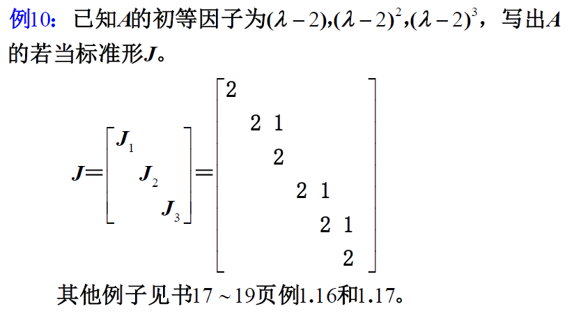

# 方阵相似的条件、若当标准形
## 方阵相似的条件
方阵$A$与$B$相似的充要条件是$A$与$B$的特征矩阵等价，而特征矩阵等价的充要条件是有全同的不变因子。

证明思路：
- 可证$A$与$B$相似的充要条件是$A$与$B$的特征矩阵等价
- 特征矩阵等价的充要条件是有全同的不变因子

### 例题1

分析：
- 如果想证明矩阵相似
- 则直接求行列式因子，看是否全同

## 方阵在相似变换下的若当标准形

分析：
- 见到若当标准形，想到`初等因子`
- $A$与$J$相似
- $J$由若当块$J_i$组成
- 注意在`若当块`对角线右上有1

### 证明若当标准形与原矩阵相似
我们证明的目标是：
- $A\sim J$
- 可以将该问题转换为证明$J$的初等因子与$A$的初等因子全同

分析：
- 上面的$\lambda E - J_i$第一个矩阵是怎么变到第二个矩阵？我个人理解：
  - $|\lambda E -J_i|$ 后，发现$D_{k_i}(\lambda)=(\lambda-\lambda_i)^{k_1}$，而$D_{k_i-1}(\lambda) =...= D_{1}(\lambda)=1$
  - 因此有$d_1(\lambda) =...= d_{k_i-1}(\lambda) = 1, d_{k_i}=(\lambda-\lambda_i)^{k_i}$
  - 进而，可以化成不变因子构成的对角阵

称$J$为在相似变换下的若当（Jordan）标准形，或称若当法式。$J$中对角块$J_i$称为相应于$\lambda_i$的一个$k_i$阶若当块。

### 例题2

分析：
- 先做各个若当块
- 别给各个若当块补 1
- 合起来

### 几个很直观的若当块推论

上述三个推论都可以直接得出。

### 例题：求若当标准形J同时求相似变换阵P

#### 例题3

分析：
- $|\lambda E - A|$ -> 行列式因子 -> 不变因子 -> 初等因子 -> 若当块 -> 若当标准形
- 设相似变换阵 $P$ ，由$PJ = AP$（$J = P^{-1}AP$）列出关系，得到$P$
#### 例题4

分析：由若当矩阵求次方（尤其是初等因子均为一次式时），方便很多。

见到求次方要想到用若当矩阵。