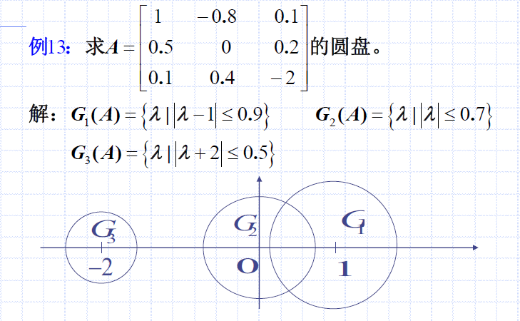

# 方阵特征值估计、圆盘定理、谱与谱半径
> 特征值是方阵和线性变换的重要指标，其计算需求解$n$次
多项式的根较复杂，而应用中有时并不需要求出其精确值。

## 特征值估计
### 圆盘
设 $n$ 阶方阵 $A=(a_{ij})_{n\times n}$，称集合$G_i (A)=\{\lambda | |\lambda -a_{ii}| \le \sum_{j\neq i}{|a_{ij}|}\}$为$A$的第$i(i=1,...,n)$个圆盘（盖尔圆）。

#### 例题

分析：
- 按照每行为单位，进行计算就好
- 注意是在复平面画图，$y$轴的单位为$i$

此外，有`连通部分`的定义：交结在一起的圆盘所构成的最大连通区域。如上例题中，共有个2连通部分。

### 圆盘定理
定理：$n$阶方阵的个特征值均落在$A$的$n$个圆盘的并集之内。

即，$A=(a_{ij})_{n\times n}$的每一个特征值均至少满足下列不等式之一：
$$|\lambda -a_{ii}|\le \sum_{j \neq i}|a_{ij}|,i=1,...,n$$

#### 证明：圆盘定理

分析：
- 最终`证明的目标`是：对于任一特征值$\lambda$，有$\lambda \in \cup_{j=1}^n G_j(A)$
- 在证明过程中，注意利用了特征值不全为0并取$|\xi_{i0}|=\max|\xi_i|$、特征值定义$A\xi = \lambda \xi$这两条性质

### 定理：m个圆盘构成1个连通部分，该部分则有m个特征值（分布结构）
上面的圆盘定理没有给出分布结构，这里给出。

设是由方阵$A$的$m$个圆盘组成的一个连通部分，则在$G$中必有且只有$A$的$m$个特征值（圆盘相重时重复计数，特征值相同时也重复计数）。

举例子如上。

### 定理：具体分布情况（缩小半径）

如上，对圆盘半径$\sum_{j \neq i}|a_{ij}|$进行了类似相似的变换，以求缩小范围。

我们可以通过这个变换，把相交的圆盘，进而确定特征值具体分布。

#### 证明：缩小半径

分析：
- 对$A$进行相似变换
- 过渡矩阵$B$为对角阵，且对角元素均大于1，因此可逆，可作为过渡矩阵
- 原理是：相似矩阵特征值相同

#### 例题：特征值范围

分析：将$b_3$设置为不等于$1$的数，实际上是在对$S_1$与$S_2$操作，因为在不等式$|\lambda -a_{ii}|\le \frac{1}{b_u} \sum_{j \neq i}|a_{ij}| b_j$中，我们有$j\neq i$。

## 谱半径的估计
### 谱与谱半径

谱是`集合`，谱半径可以理解为`最长的特征值的模`。

### 谱半径的估计
$$\rho(A) \le \min\{ \max_i \sum_{j=1}^n |a_{ij}|, \max_j \sum_{i=1}^n |a_{ij}|\}$$

#### 证明

这里为何要引入转置矩阵$A^T$呢？
- 转置矩阵$A^T$一定相似与$A$，一定有相同谱半径
- 可以缩小个范围，提高精度，不用白不用

#### 例题：谱半径

谱半径相应的特征值称为`主特征值`，其特征向量称为`主特征向量`。
