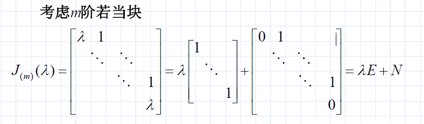

# 矩阵分析、矩阵序列、方阵幂级数、方阵函数
## 矩阵序列
### 定义：矩阵序列

分析：
- 注意这里的矩阵是多个，在序列中
- 即对每个元素分别求极限
- 就是该矩阵序列中的极限

### 例题：矩阵序列

分析：
- 分别求极限即可

### 性质：矩阵序列

分析：
- 类似数的极限，矩阵序列的极限也可以拆开
- 此外，进行`相似变换`后的矩阵，收敛到`经过同样相似变换`的矩阵（这条性质很有用，之后再`仿真幂级数`中会用到）

## 方阵幂级数
### 泰勒展开

泰勒展开将要用到。

### 幂收敛
#### 定义：幂收敛
#### 条件：幂收敛
$A$的幂收敛问题等价于其若当形$J$的幂收敛问题。

我们最终要得出的定理是：

证明一下。

如上，如果$J^k$收敛于$J_0$，那么$A^k$收敛于$P J_0 P^{-1}$。

而对$J$的幂收敛的讨论，可以转化为对其若当块$J_i$的讨论$(i=1,...,s)$。

分析：
- 如上，利用了若当块的特殊形状，将其拆分为$\lambda E + N$
- 对于$J_{(m)}^k(\lambda),(k\ge m)$，我们开始查看矩阵内的每个元素，希望其每个元素都分别在$k\to \infty$时收敛
- 因此，如下，继续证明

分析：
- 如上，对于对角元$\lambda^k$，只有$|\lambda|\le 1$时才收敛
- 对于非对角元$u_k$，只有$|\lambda|< 1$时才收敛（但是，如果若当块$m=1$，则不存在非对角元$u_k$，此时可以有$|\lambda|\le 1$）
- 定理得证

再放一下定理，用于回顾证明过程。

#### 例题：判断幂收敛

分析：
- 直接求特征值

### 方阵幂级数
#### 定义：仿真幂级数

分析：
- 注意幂级数是**序列的求和**

#### 收敛半径

分析：
- 使用$\lim_{k \to \infty} |\frac{a_{k+1}}{a_k}|=\rho$得到$\rho$
- 注意$R$与$\rho$是倒数关系
  - 即$\rho=0$，后一项不比前一项大（不高出数量级），$R=+\infty$，无论$x$取多少都收敛
  - $\rho=+\infty$，后一项比前一项大（高出数量级），$R=0$，无论$x$取多少都发散

#### 方阵幂级数的收敛条件
可以使用类似`条件：幂收敛`中的推导。

依旧，可以将`整体的目标`（$\sum_{k=0}^\infty a_k A^k$）的收敛性转换为`对每个若当块`的讨论。

下面我们来看若当块。

对于若当块中的每个元素，进行如下变换，利用微积分变成与$f(x)=\sum_{k=0}^\infty a_k x^k$相关的式子。

因此得到如下定理。

分析：
- 主要使用上述的(1)
- 即，求$A$的谱半径，判断方阵幂级数是否收敛
- 具体来讲，需要使用$f$中$a_k$，通过$\frac{a_{k+1}}{a_k},k\to \infty$求得$\rho$
- 求$f(A)$则使用(2)
- 即，求$f(A)$则目标变为求$P$与$J_f$
- 若要求$J_{f_i}$，则对$f$整理（一般去掉$f$中$\sum$符号）、求导

#### 例题：方阵幂级数收敛、求和f(A)

分析：
- 首先整理$f$，把$\sum$符号去掉
- 根据$\frac{a_{k+1}}{a_k},k\to \infty$求得$\rho$，进而求得收敛半径$R$，判断收敛性
- 题目要求：求$f(A)$，那么通过$f(A)=P[J_{f_i}]P^{-1}$来求
  - 求若当形$J$（行列式因子->不变因子->初等因子）
  - 求过渡矩阵$PJ=AP$（$J=P^{-1}AP$）
- 对$f$求导，依据$J_{f_i}$公式代入得到$[J_{f_i}]$
- 得到$f(A)$

#### 例题：方阵幂级数收敛、求和f(J)
$f(J)$即$[J_{f_i}]$。

这是对上一道例题的补充，在若当块维度大时，我们可以先求$f^{(n)}(x)$这些要用到的导数，然后带入$\lambda$。

## 方阵函数
### f(A)

如上我们讨论了常用的三种方阵函数：指数函数正弦函数、余弦函数。无论$A$的特征值为何，$f(A)$都收敛。

#### 两道常用f(x)例题

第一道例题分析：
- 求若当形和过渡矩阵（$|\lambda E - A|=0$行列式->特征值->$P$，这个例题的例子不好，求$P$的标准过程见下一例题）
- $P^{-1}$和$P$，带入公式

第二道例题分析：
- 行列式因子->不变因子->初等因子->`若当标准形`
- $AP=PJ$->相似变换阵$P$
- 代入公式

### f(At)
$t$是常数，唯一值得注意的就是，在求导时把$t$记得带上。

具体见下面的例题。

已知$A$的若当形：

注意，对于$e^{At}$，带上了$t$。
