# 距离空间及其完备性
首先明确泛函的研究对象：
- 空间：赋予了某种数学结构的非空集合
- 算子：两个集合间的映射

## 距离与距离空间
### 定义：距离
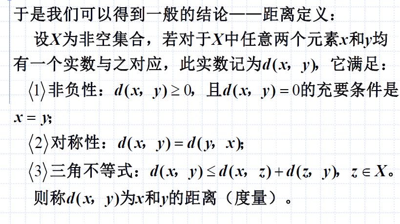

分析：
- 判断是否为距离，即判断$d$是否满足上述三个性质
- 是任取$x,y \in X$
- 一般可以用“$d(x,y)=0$但$x \neq y$”来反证不是距离
- 此外，也可以用特殊的$(x,y,z)$带到三角不等式里面，举反例

### 例题1：是否为距离
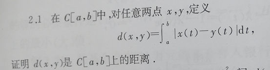
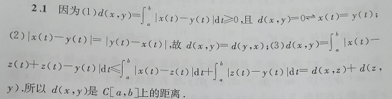

分析：
- 依次检验三条性质即可
- 答案写得不标准，应该有`任取`$x,y \in C[a,b]$

### 例题2：是否为距离
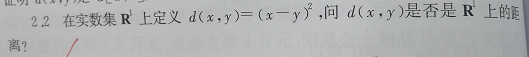
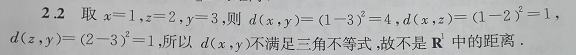

分析：利用了反例，三角不等式。

### 定义：距离空间
定义了距离$d$的非空集合$X$，称为距离空间，可简记为$(X,d)$。

### 例题3：讨论以下定义是否为距离
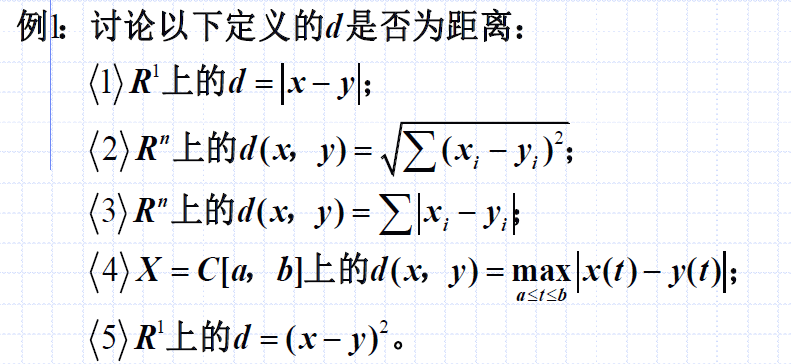

**(1)** 易征，略。

**(2)** 的第三条性质“三角不等式”需要额外推导一下。

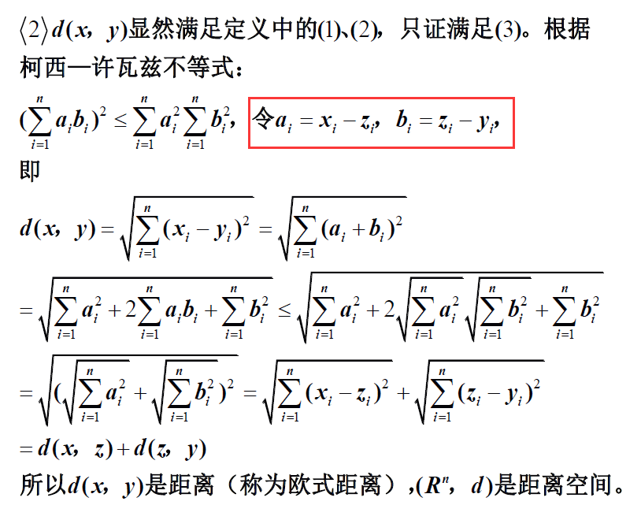

分析：为了引出$d(x,y)$与$z$的关系，特意设定了如上我用红框标注的关系：$a_i = x_i - z_i$，$b_i = z_i - y_i$。

**(3)**

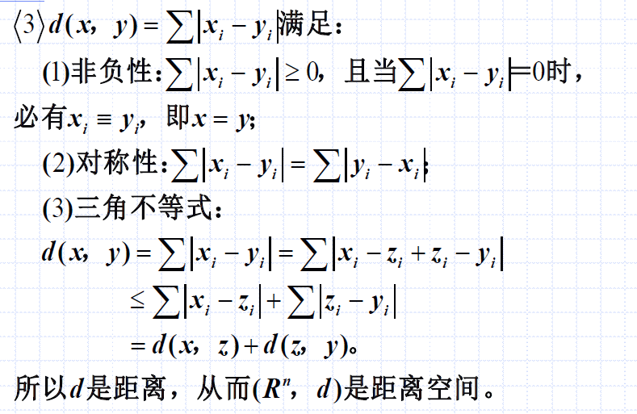

有句话值得琢磨：由(2)、(3)可见，在同一空间$R^n$上，可以定义不同的距离（$\sqrt{\sum_{i=1}^n (x_i - y_i)^2}$和$\sum_1^n |x_i - y_i|$），从而构成不同的距离空间。

上述这句话码提示了我们：距离空间与距离密切相关，距离定义了距离空间。

**(4)**

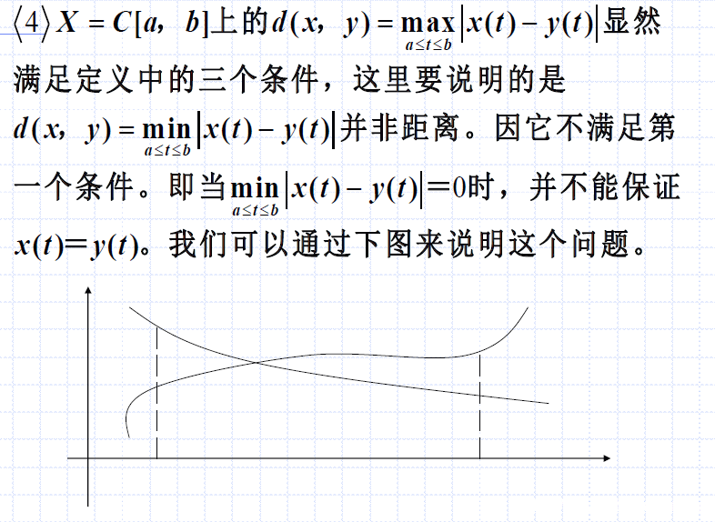

分析：
- 这个值得注意，这里的距离`不是两个点`的距离，`而是两个函数`的距离
- 注意，$\min_{a\le t \le b}|x(t) - y(t)|=0$中，这个$\min$是针对$t$而言的
  - 这就是说只要有一处$t=t_0$，使得$x(t_0)=y(t_0)$，那么就会有$\min_{a\le t \le b}|x(t) - y(t)|=0$，如上图两条曲线有一个交点
  - 但这就与“$d(x,y)=0$互为充要条件$x = y$”不符合，因为$x(t)$与$y(t)$只在$t=t_0$处相等，并非$x(t)=y(t)$两个函数相等

**(5)**

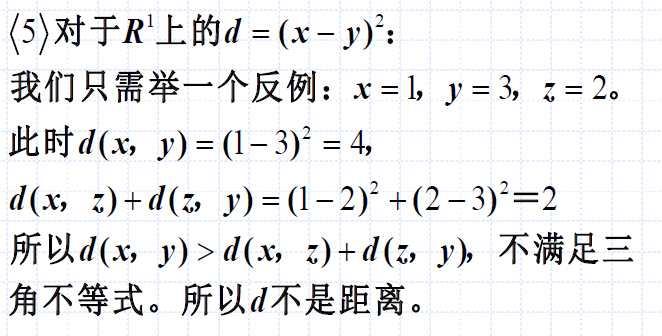

## 距离空间的完备性
### 定义：点列的极限
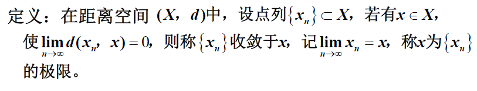

### 定义与性质：柯西列
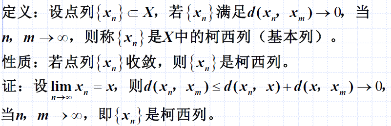

分析：
- 点列收敛，一定是柯西列（证明中利用了距离的性质）
- 柯西列不一定收敛
- 柯西列可以理解为两个点都向远处跑，二者距离为0（$d(x_n,x_m)\to 0;m,n\to \infty$）

**例子：是柯西列，但是不收敛。**

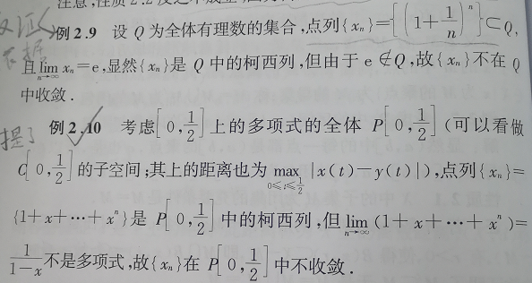

如上两个例题，并没有说该柯西列`不收敛到某个数`，而是收敛后不属于该空间了。因此说，`不收敛`。

### 完备性
定义：若$X$中任意柯西列均收敛，则称$(X,d)$是完备的距离空间。即：$X$对极限运算封闭。

即：`柯西列`在该空间`收敛`，该空间完备。

#### 重要定理：R1柯西列完备
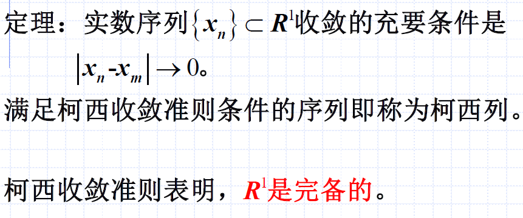

这个在证明完备性的例题种很常用。

#### 例题4&5：证明距离空间完备
**例题4**
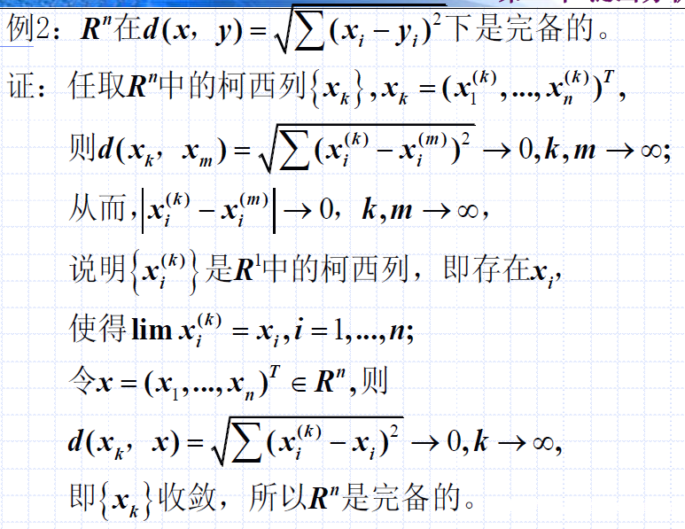

**例题5**

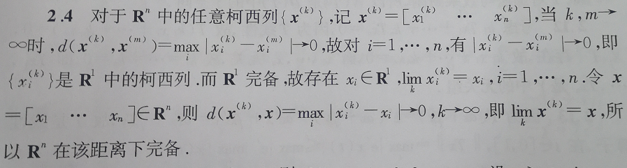

分析：
- 先证明是柯西列
- 再任取一个维度，利用$R^1$完备的特点，得出$\lim_k x_i^{(k)}=x,i=1,...,n$
- 再带回去得到$x=(x_1, ..., x_n)^T;d(x_k,x)\to 0;k\to \infty$

#### 例题：证明离散距离空间是完备的

分析：
- 因为是离散距离空间，因此如果二者$d\to 0$
- 则说明两个点也相等，则有$x_m = x_k$
- 那这里可以按住一个点，比如设$m>k$，按住$k$，$x_k$则为收敛判定$\lim_k x_m=x_k;m \to \infty$中的常数
