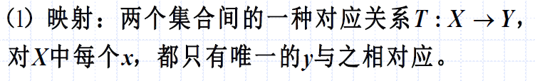
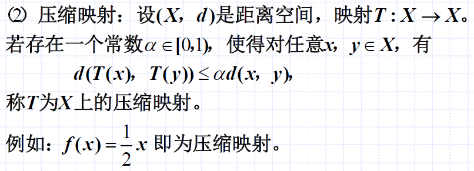
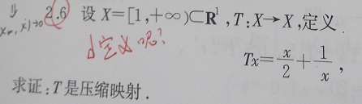
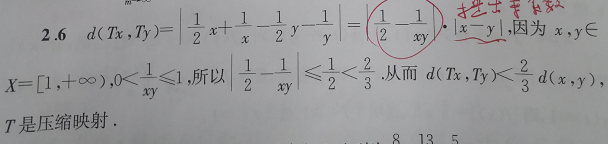
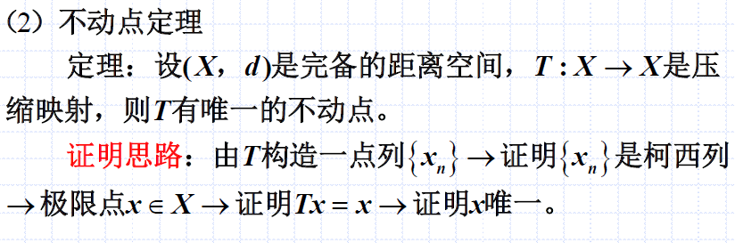
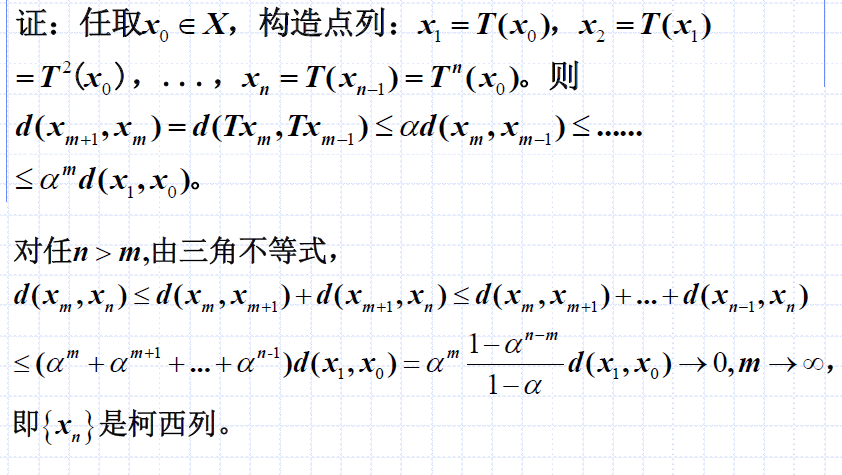
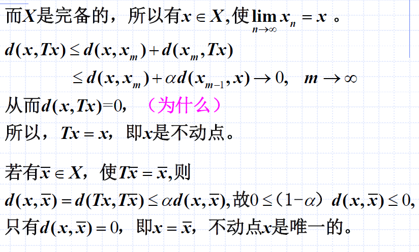
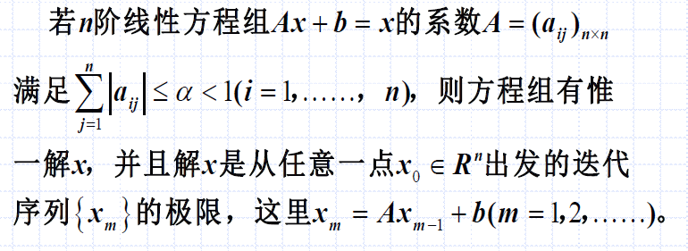
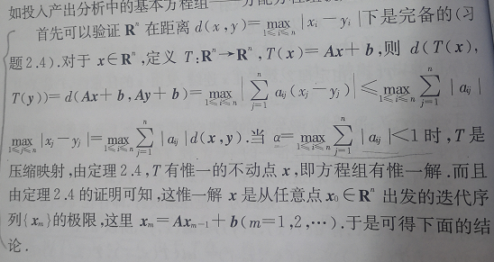
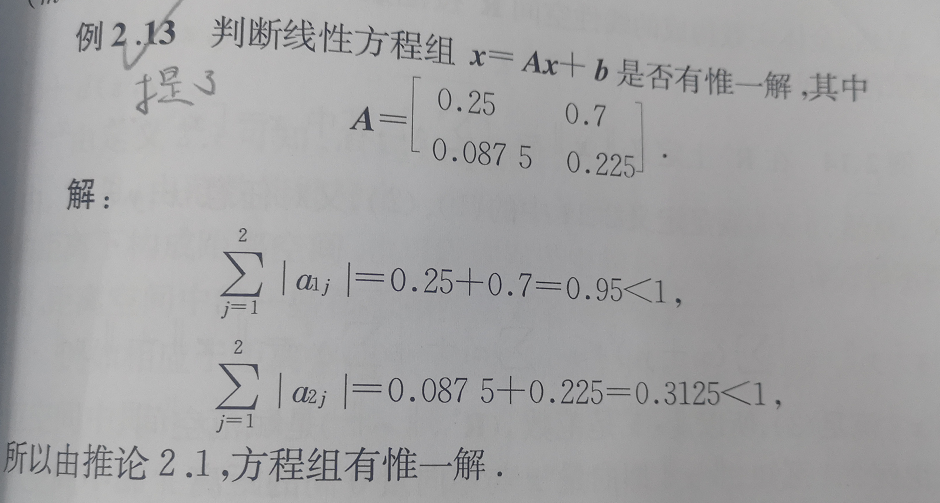

# 压缩映射与巴拿赫不动点定理
## 压缩映射
### 定义：映射

分析：
- 宏观上，映射是集合到集合的关系
- 微观上，是俩元素之间的元素的关系

### 定义：压缩映射

分析：
- 经过映射后，两点间距离更小
- 问题：距离怎么定义？任取一种距离还是对于任何距离都成立？
- 答：$(X,d)$是完备的距离空间，则有一种$d$使其完备，就行

#### 例题：求证T是压缩映射

分析：
- 只要取一种$d$就行
- 证明的目标当然是定义：$d(Tx,Ty)< \alpha d(x,y),\alpha \in [0,1)$

## 不动点定理
### 定义：不动点
$$Tx=x$$

$x$为$T$的不动点。

给出例子：
- 无穷多不动点：$f(x) = x$映射
- 没有不动点：$f(x)=x^2+1$

### 不动点定理

完备距离空间内，压缩映射具有唯一不动点。

#### 证明：不动点
证明如下。

分析：
- 证明的最终目标：得出$Tx=x$，且$x$唯一
- $Tx=x$可以由$d(x,Tx)=0$得到（$d(x,Tx)=0$可以由距离性质（三角不等式）、压缩映射性质（引出$\alpha$）、完备性（收敛到$x$）得到）
- $x$唯一可以由`反证法`得到，假设存在另一个不动点$\bar{x}$，最终导出$d(x,\bar{x})=0$，由距离性质，$x=\bar{x}$，不动点唯一

### 不动点定理的应用：投入产出分配方程组

看定理有点费解，先证明，如何应用看例题。

#### 证明：投入产出分配方程组有唯一解

如上，我们使用了一个距离$d(x,y)=\max_{1\le i\le n}|x_i - y_i|$。为了使用压缩映射的`性质`（完备距离空间内，压缩映射具有唯一不动点），我们查看$T$是否是压缩映射。于是构造$d(T(x),T(y))$，看什么条件下$T$是压缩映射。也就是说，看什么条件下该方程组有唯一解。

#### 例题：投入产出分配方程组是否有唯一解

如上，对于每行，求绝对值的和，判断是否小于1。
