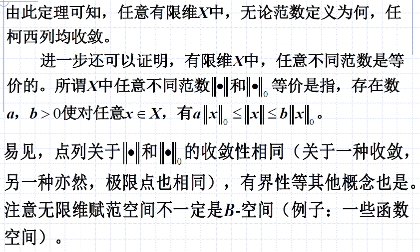

# 赋泛空间与巴拿赫空间
线性空间建立了元素间的线性运算，而有时还需元素的度量。距离是任两元素间一种度量，而范数则是每个元素自己（或与0元素间）的度量。

## 范数与赋范空间
### 范数

与距离的条件相比，第(2)条变成了$\alpha$常数（线性）的可拆。距离的第(2)条则是对称性。

### 赋泛空间

与距离空间类似，线性赋泛空间同样是与空间一起定义。

### 范数与距离的关系

#### 证明：赋泛空间到距离空间

如上，只需证明$||x-y||$满足距离的性质即可。如果$||x-y||$是距离，则称$||x-y||$是由范数导出的距离。

可以理解为：赋泛空间是一种特殊的距离空间。

如上，在赋泛空间中依然有`收敛`、`柯西列`概念。

## 巴拿赫空间
完备的线性赋泛空间称为`巴拿赫空间`，简称`B-空间`。

如上，我们早就证明过，如果距离为$|x-y|$、$\sqrt{\sum(x_i-y_i)^2}$等距离下，空间是完备的。对于赋泛空间，同理。

### 引理：空间中一线性无关组，存在常数下界

上述式子中值得注意的是，$\alpha_1 x_1 + ... + \alpha_n x_n = 0$时，因为$x_1,...,x_n$线性无关，所以必有$\alpha_1=...=\alpha_n=0$，所以成立。

### 性质：任意有限维赋范空间均是B-空间
下面是证明。

思路与`证明某个距离空间完备依旧相同`：
- 任取柯西列，转化为一维元素的关系
- 一维元素是柯西列，并且有先决条件`一维空间一定完备`
- 则一维元素收敛
- 则带入，高维柯西列收敛

此外，要注意：
- 我们这里应用了`任意有限维`这一性质
- 这意味着有式子$||\alpha_1 x_1 + ... + \alpha_n x_n|| \ge C(|\alpha_1| + ... + |\alpha_n|)$可以用
- 在有限维$X$中，任意不同的范数是等价的
