# 有界线性算子与泛函、例题
## 有界线性算子与算子空间
### 有界线性算子
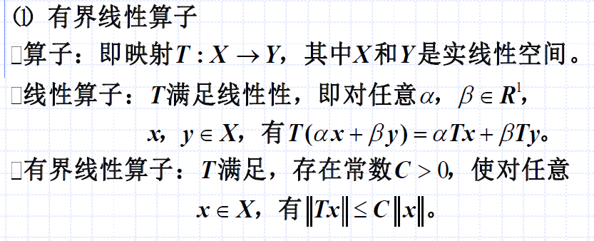

分析：
- 算子：就是映射
- 线性算子：$T(\alpha x + \beta y) = \alpha T x + \beta T y$
- 存在常数$C>0$，对任意$x\in X$，有$||Tx||\le C||x||$

#### 定理：有限维赋范空间X上的任一线性算子T都是有界的
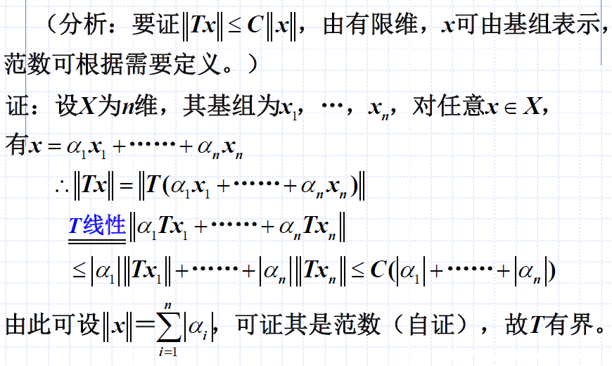

上面的证明有一丝说不过去：
- 最后一步$\le$怎么过来的？
- 需要进一步了解，阅读专业泛函资料

### 算子空间B(X,Y)
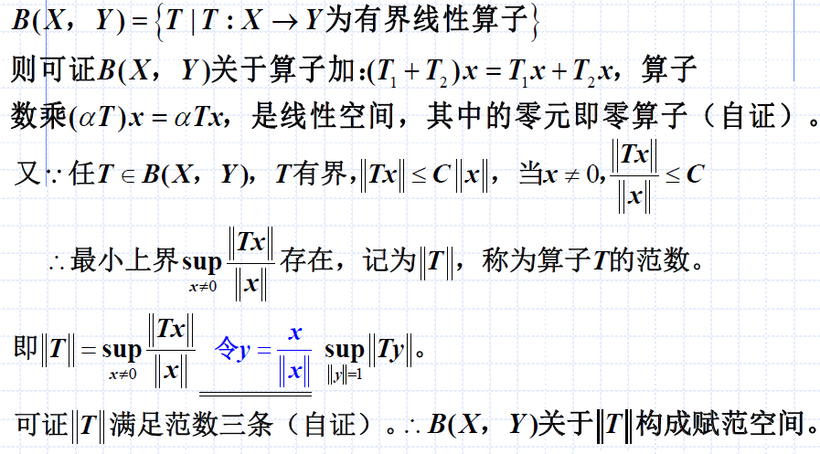

值得注意的是：
- 算子空间是`关于算子的集合`
- $||T||$是`最小`上界$sup$
- 这个`最小`+`上界`我们将在下面的例题中感受到

#### ||T||满足范数三条：B(X,Y)关于||T||构成赋泛空间
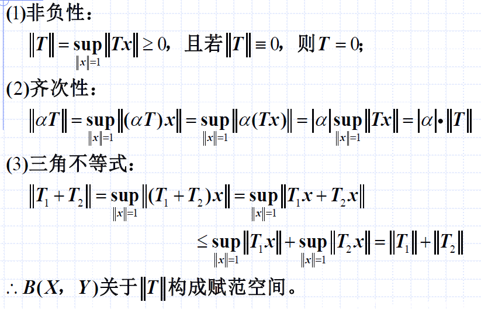

如上：
- 因为满足三条
- 所以是范数，所以构成赋泛空间

#### 例题：求||T||
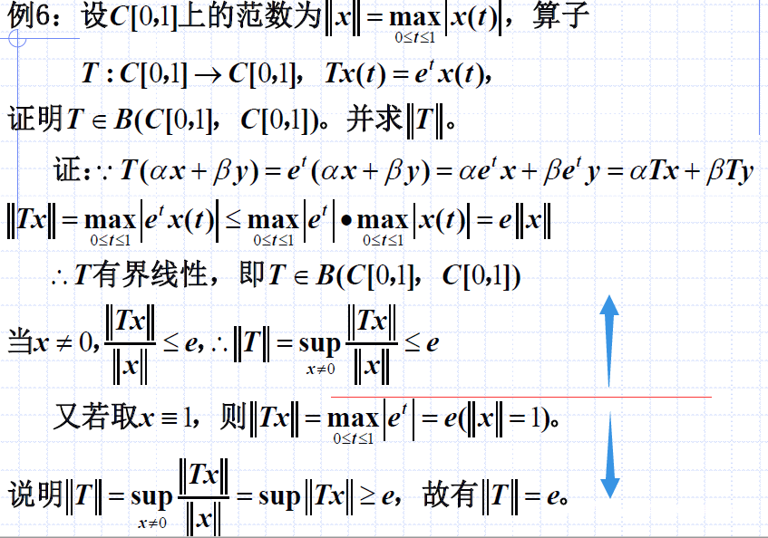

如上，两部分：
- 证明 $||T||\le e$
- 证明 $||T||\ge e$
- 所以有 $||T|| = e$

思路：
- 线性$T(\alpha x + \beta y) = \alpha T x + \beta T y$ -> 有界$||Tx||$与$||x||$的关系 -> $T$有界线性
  - 其中，要利用$T$与$||x||$在本题目中的具体定义（如何算的）
- $x$是一个关于$t$的函数，另$x1\equiv 1$（恒等于1）
  - 可得此使的 $||Tx||=e$
  - 而带入$\frac{||Tx||}{||x||}$的式子，得到值为$e$
  - 这说明$sup...$一定大于等于$e$，即$||T||\ge e$
  - 为什么？因为$sup$是`最小上界`，在$x$为某一值A时，$sup$为某一值B，则说明$sup$最小为B，否则就不是所有$x$对应的最小上界了

## 例题
### 例题1：证明线性赋泛空间中成立某一关系
$$|||x||-||y||| \le ||x-y||$$

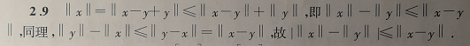

分析：
- 既然要证明绝对值，那就把绝对值打开，正负都证一遍
- 如何才能把构造多个范数的关系？使用性质(3)，则有$||x|| = ||x-y+y||\le ||x-y|| + ||y||$

### 例题2：证明是线性算子
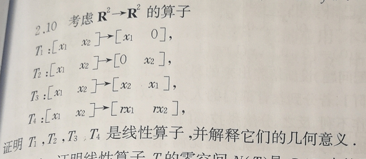
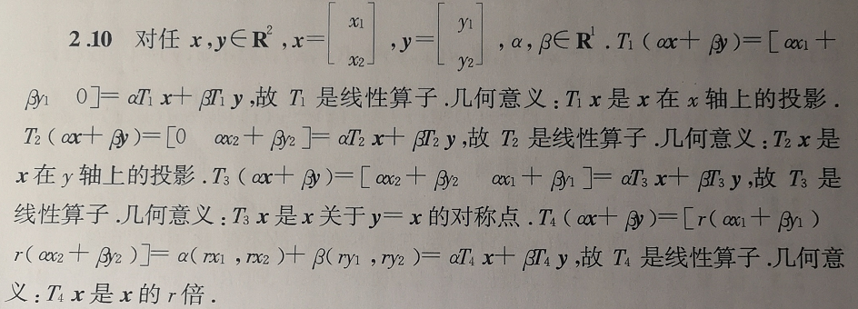

分析：
- 是线性算子，则证明$T(\alpha x + \beta y) = \alpha T x + \beta T y$即可

### 例题3：是子空间
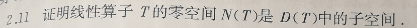
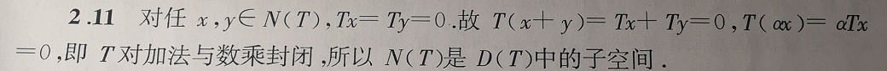

分析：
- 是子空间，即对加法和数乘封闭

### 例题4：证明线性无关组
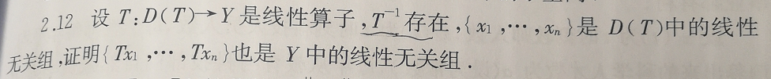
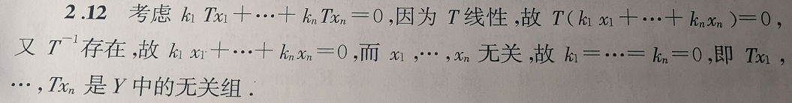

分析：
- 如果想证明${A,...,Z}$是线性无关组，构造$k_1A+...+k_n Z = 0$，证明其中必有$k_1=...=k_n=0$即可
- 利用了$T$是线性，可以提出来的性质
- 又利用了$T^{-1}$存在的性质
