# 凸集与凸集分离定理、Farkas引理
## 凸集
### 定义：凸集
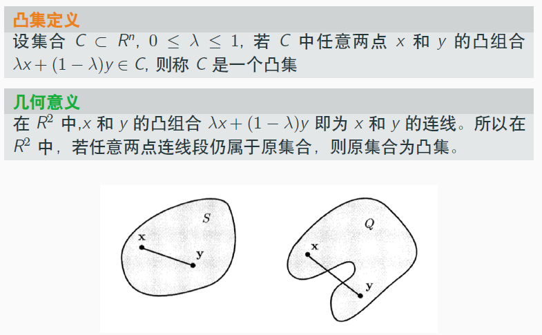

注意凸集的定义，`任取两点`满足某个条件为凸集：
- 证明`是凸集`的目标有了
- `凸集的性质`也有了，可以利用

### 凸集性质（逐个证明）
**(1)**

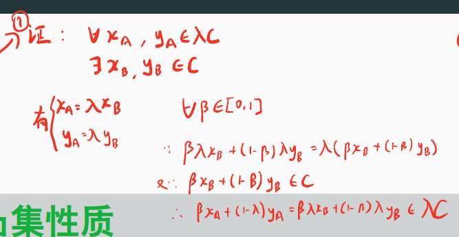

分析：
- 任取$x_A,y_A \in \lambda C$，因为是要证明$\lambda C$是凸集
- 也就是要对于所有的$x_A,y_A \in \lambda C,\beta \in [0,1]$，都有$\beta x_A + (1-\beta) y_A \in \lambda C$
- 能利用的性质只有$C$是凸集`以及`$C$与$\lambda C$两个集合的关系（从微观上，一定存在$C$中元素乘上实数$\lambda$在$\lambda C$中），应该在二者间建立联系

**(2)**

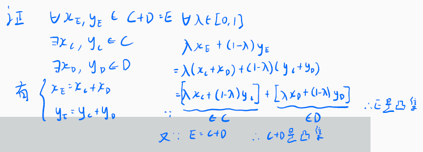

分析：
- 与上一题思路相同

**(3)**

有限个凸集的交集为凸集。

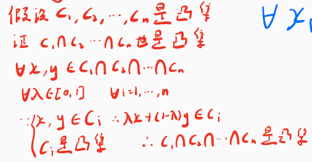

**由以上凸集性质，我们做下面两点例题。**

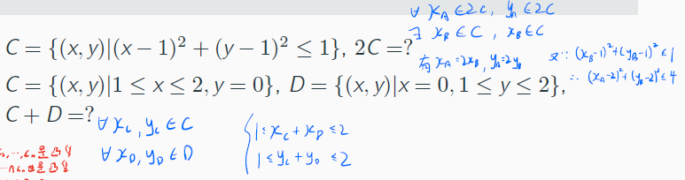

分析：
- 分别在集合间取元素，根据集合性质建立元素间关系
- 然后带回去，这样从原理出发计算不会出错

## 超平面
### 定义：超平面
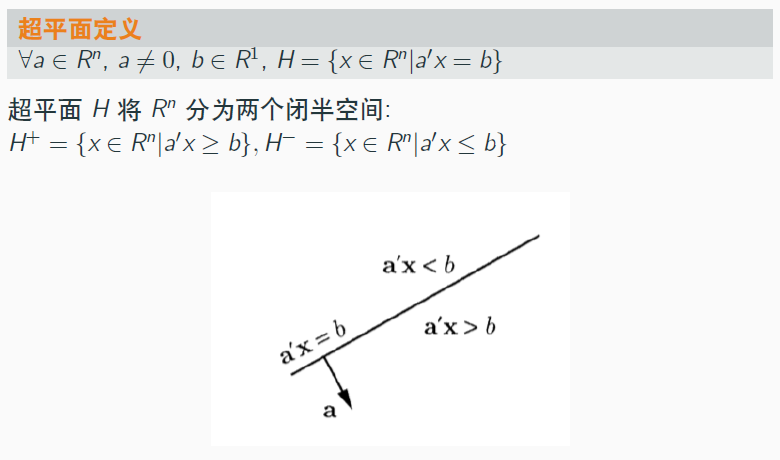

分析：
- $a' x = b$在$R^2$是直线，在$R^3$是平面，在$R^k,k>3$当然就是超平面了
- 注意$a$实际上超平面的法向量，与超平面垂直；$b\in R^1$决定了超平面的位置
- 闭半空间一共有两个（一侧的点与法向量构成锐角，一侧是锐角）

### 证明：超平面是凸集
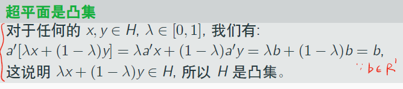

很简单，对于`闭半空间是凸集`同理，将$=$换成$\le$或$\ge$即可。

### 定义：支撑超平面
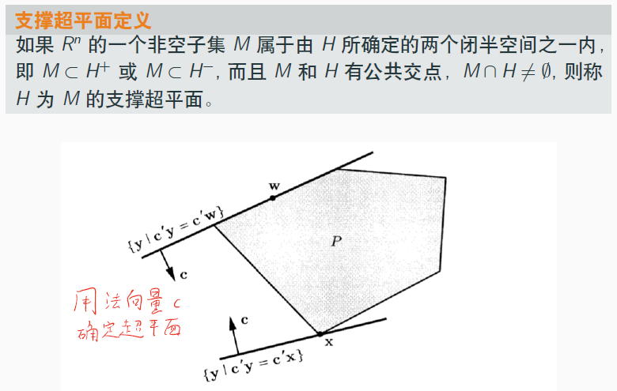

分析：
- “支撑”即超平面对这个空间的生成起了作用，“触碰”到了这个空间

### 定义：多面体
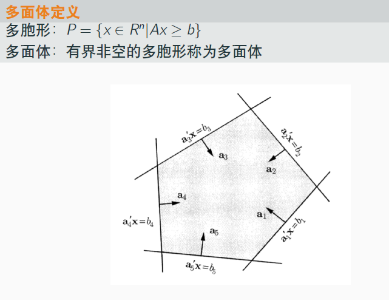

多面体：
- 是多胞形（上图的多胞形定义，我觉得不对）
- 有界非空

### 定义：凸锥
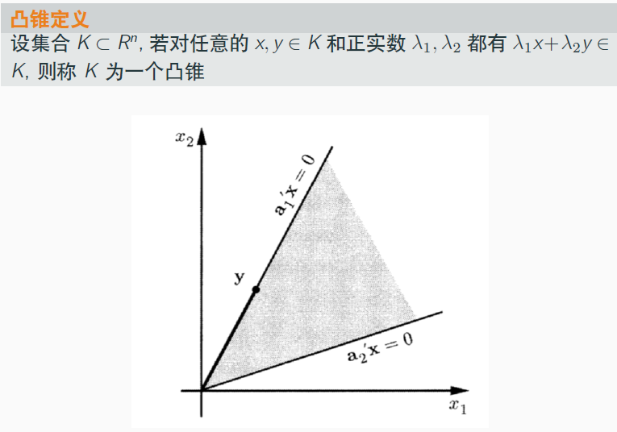

分析：
- 经过原点$\vec{0}$，因此超平面中$b=0$
- $\lambda_1 x$ 与 $\lambda_2 y$ 相加，实际上表示了两个超平面的中和，即相互趋近

## 凸集分离定理
### 定义：分离
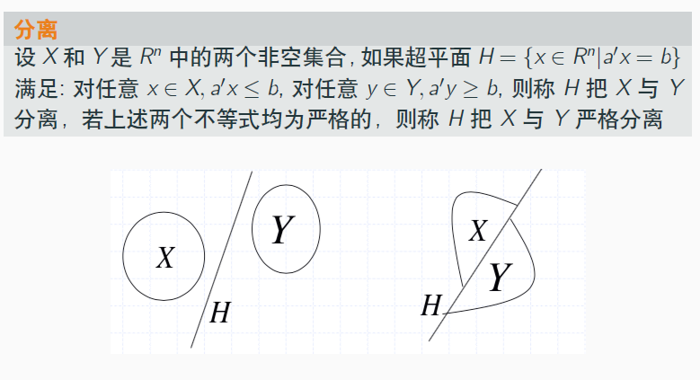

分析：
- 两个非空集合，可以被几何的概念（超平面）分开，不重叠（但是可以重叠在超平面上）
- 如果`没有`$\le$与$\ge$即等号关系，则是`严格分离`

### 定义：凸集分离定理
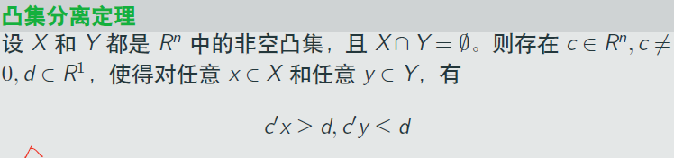

如上是凸集分离定理（如果两个集合是不相交的凸集，那么可以被一个超平面分开）。

证明过程很长，证明并应用了：Weierstrass定理、点集严格分离定理、支撑超平面定理。

## Farkas引理
### 定义：Farkas引理
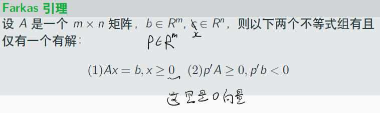

用于后面的凸规划，这里注意一点：
- (1)有解了，(2)必无解

### 证明：Farkas引理
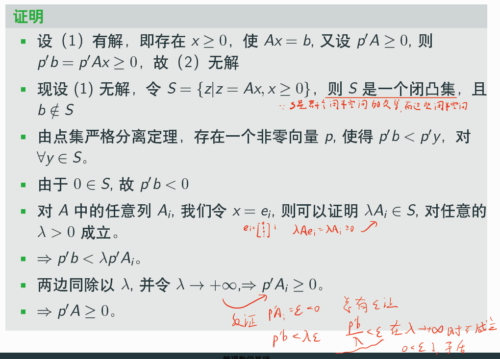

首先，假设(1)有解，证明(2)无解即可；接着证明(1)无解情况下，(2)必有解，大概思路是：
- $\forall y \in S$，由(1)无解可得$b \notin S$，由此，利用点集分离定理，得到$p' b < p' y$
- 进一步，由$0 \in S$，则有$p'b < 0$，现在(2)的第二个式子已经证明完毕了，接下来是第一个式子$p'A \ge 0$的证明
