# 凸函数
## 定义：凸函数
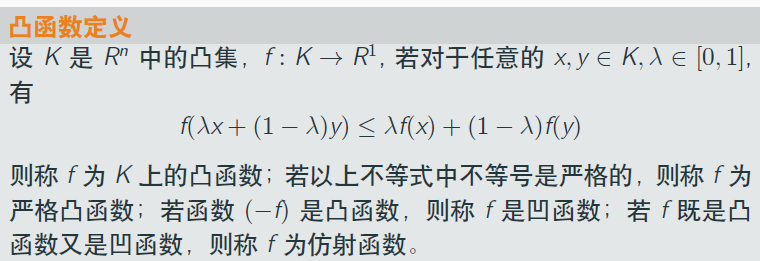

$$f(\lambda x + (1-\lambda)y) \le \lambda f(x) + (1-\lambda)f(y)$$

说$f$是凸函数，起码想到使用上式。此外，$f$又凸又凹，是`仿射函数`。

## 几何意义：凸函数
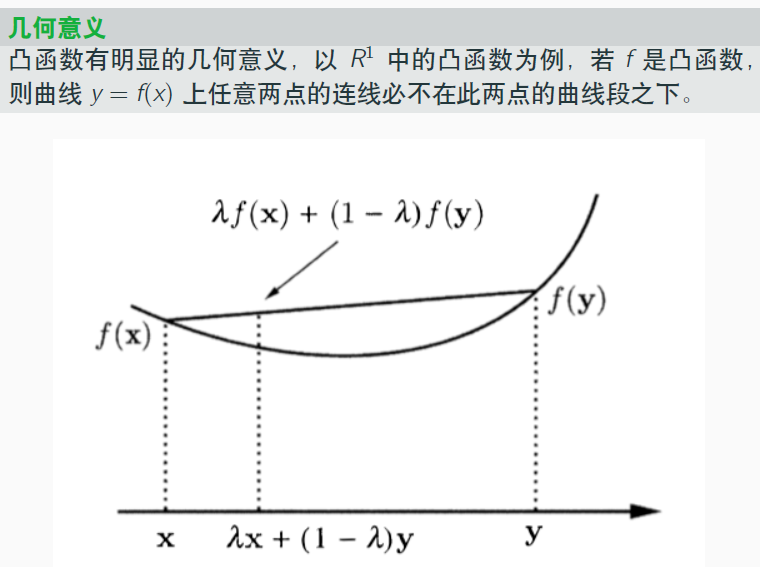

分析：
- 很直观，$\lambda x + (1-\lambda)y$即$x$与$y$两点连接的线段上的点
- 注意凸规划里凸是`向下`凸的

## 凸函数的几个定理：逐个证明
**(1)**

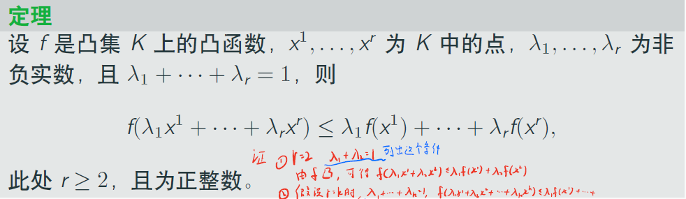
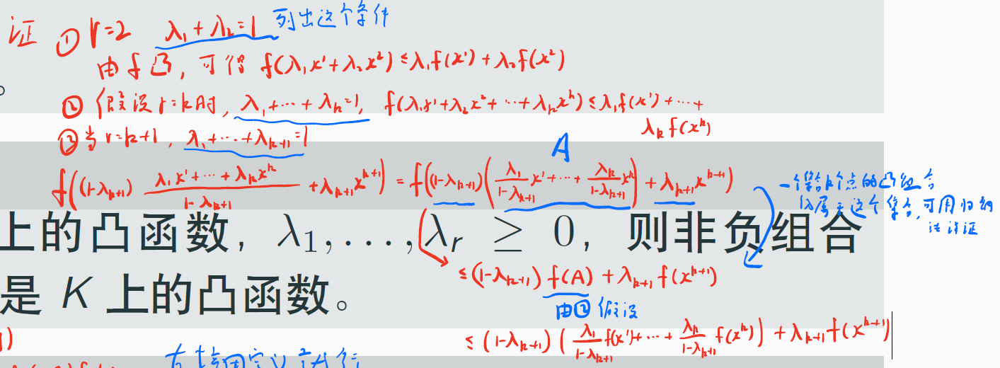

如上，证明可以用数学归纳法证明：
- 为何要在③中提取$1-\lambda_{k+1}$出来，因为这样$x^i$的系数才是$\frac{\lambda_i}{1-\lambda_{k+1}} < 1$（因为有$\lambda_1 + ... + \lambda_{k+1}=1$）
- 才可用应用②中我们对$r=k$做的假设

**(2)**
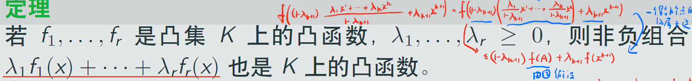
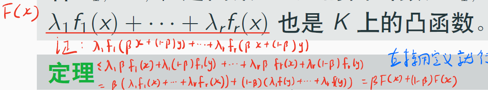

分析：
- 把“非负组合”理解为一个$F(x)$，然后直接用定义即可

**(3)**

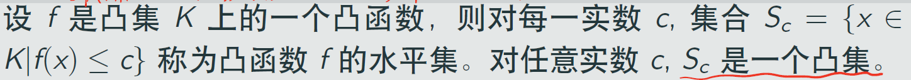
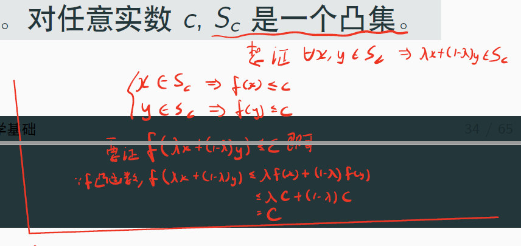

分析：
- 明确正面的目标
- 使用题目给的性质、凸函数性质，即可

**(4)**

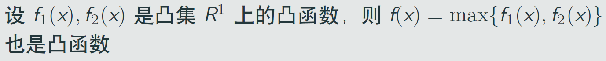
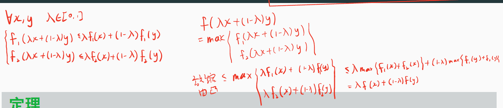

分析：
- 遇到$max$，考虑放缩（上图存在笔误，即应该是$\lambda \max\{ f_1(x), f_2(x) \} + (1-\lambda) \max\{ f_1(y), f_2(y) \}$）
- 共经历了两层放缩：凸函数的性质一层、$max$一层

**(5)**

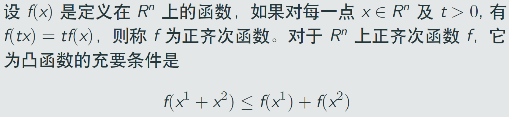

分析：
- 你可以去理解“什么是正齐次函数”，也可不去（因为对证明题目没什么帮助）
  - 我的理解是，$x$在$f(x)$中是一次的，因为$t$可以被提出来

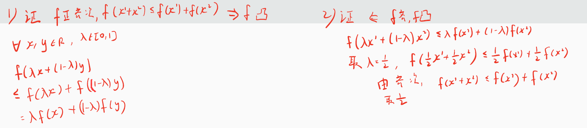

分析：
- 证明充要条件，当然充分性与必要性都要证明
- 注意：$f$是正齐次函数，是已知、是条件，而非要正面的东西
- 对于充分性$\Leftarrow$的证明，因为$f(\lambda x^1 + (1-\lambda )x^2) \le \lambda f(x^1) + (1-\lambda) f(x^2)$是已有性质，因此可以取特殊值$\lambda=\frac{1}{2}$，来继续推导

## 梯度
### 定义：梯度
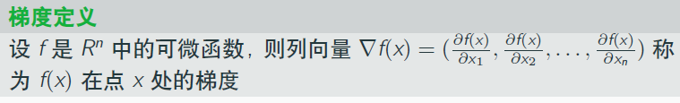

### 定义：Hesse矩阵
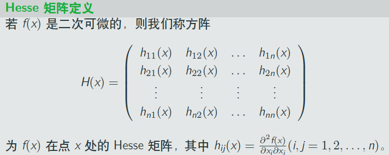

### 定理：$f(x)\ge f(y) + \nabla f(y)^T (x-y)$
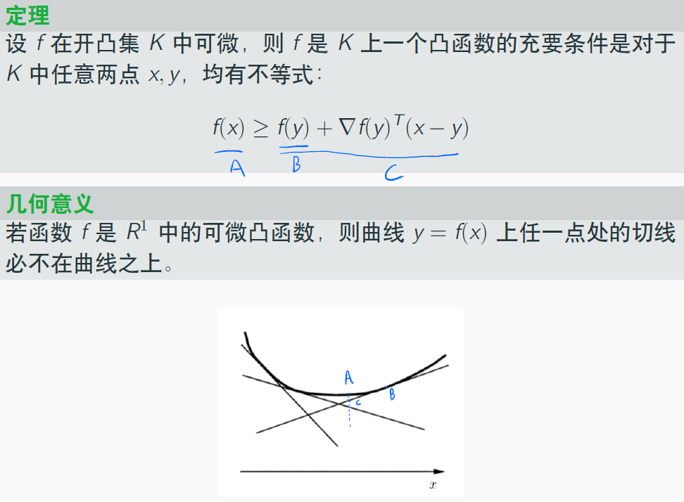

如上，$A$、$B$、$C$分别分别代表y轴值，我将其标注了出来。

#### 该定理的证明
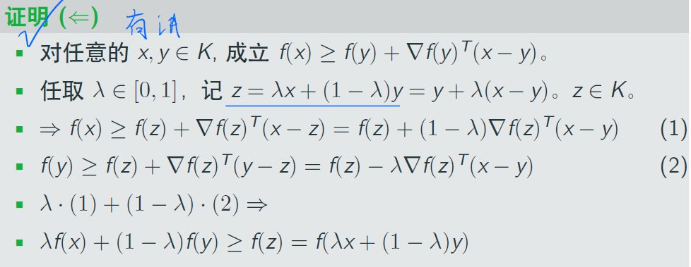

分析：
- 在充分性的证明中，最重要的是构造$z=\lambda x = (1-\lambda)y$
- 然后利用已有的性质，进行代换，向着目标推进（目标是凸函数的定义式）

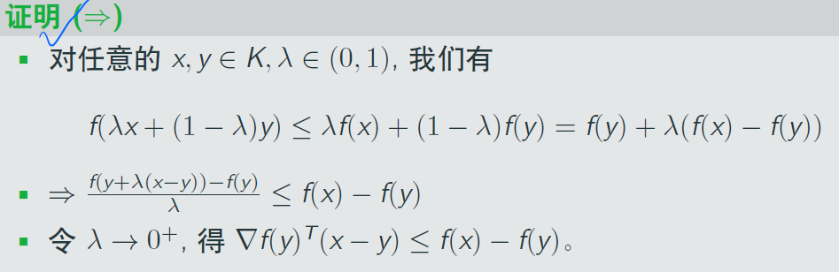

分析：
- 在必要性的证明中，巧妙地利用了$\lambda \to 0^+$时，出现梯度，引出了$\nabla$符号

#### 该定理的严格形式
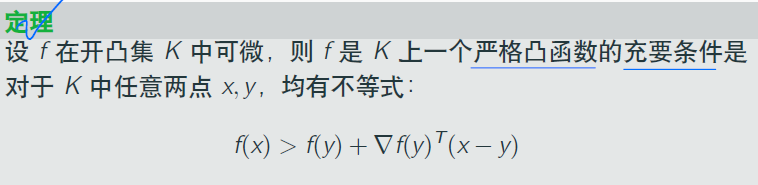
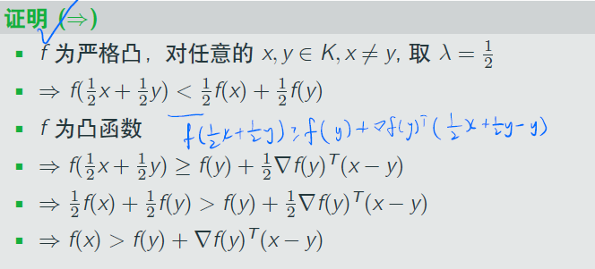

分析：
- 对于充分性证明，与不严格时相同；
- 对于必要性证明，则不同
  - 利用了不严格时的定理，引出带有$\ge$与$\nabla$的不等式
  - 显然，我们需要把$\ge$去掉，则要结合严格凸的式子
  - 使用$\lambda = \frac{1}{2}$将其结合

### 定理：海赛阵半正定与凸函数
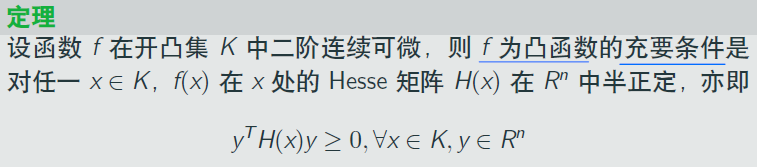

#### 证明：海赛阵半正定与凸函数
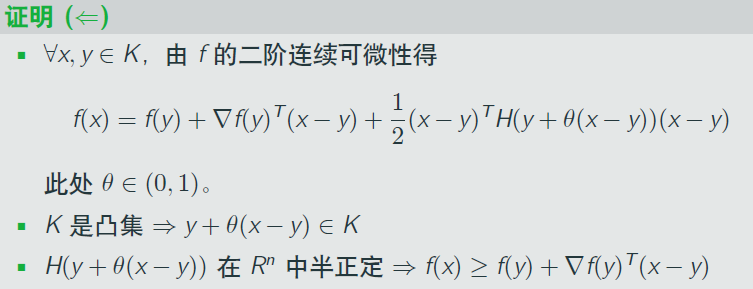
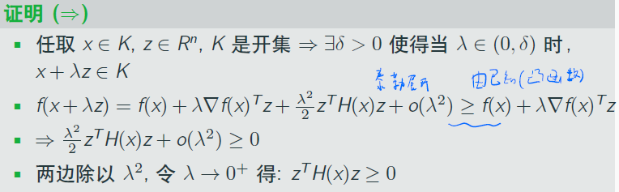

分析：
- 都没有直接引用凸函数定义式，而是以用与凸函数等价的$f(x)\ge f(y) + \nabla f(y)^T (x-y)$
- 都应用了二阶展开（泰勒公式）

### 定理：正定则严格凸
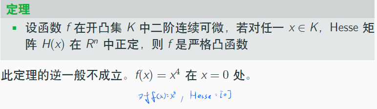

注意逆定理不成立。

### 判别：更方便的方法
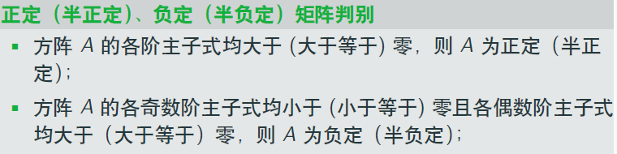

直接用定理判断是否正定，不方便，这里提供了“主子式”的判别方法。

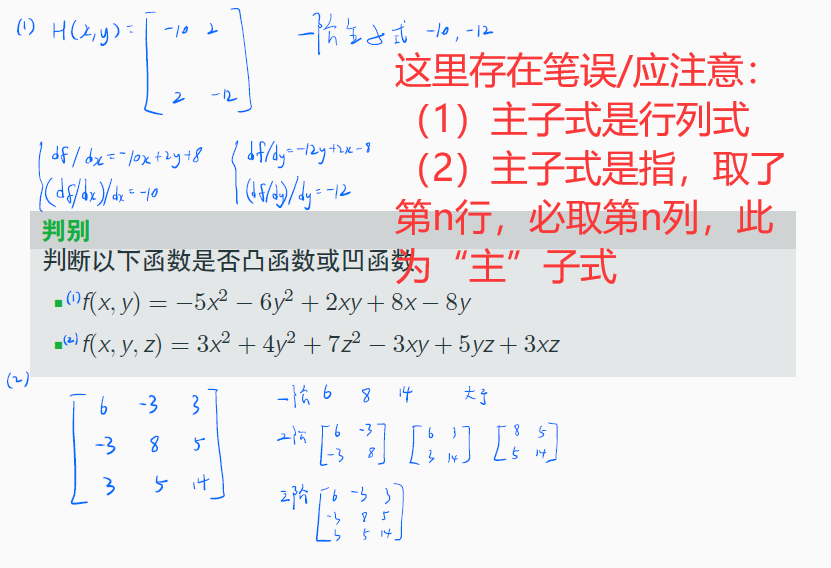

计算实例如上。
