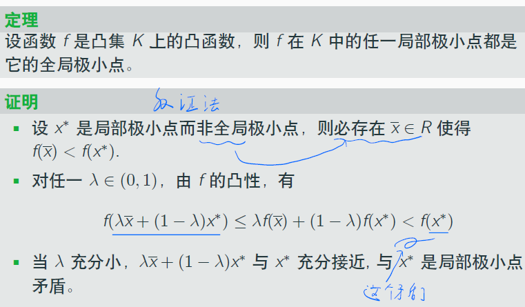
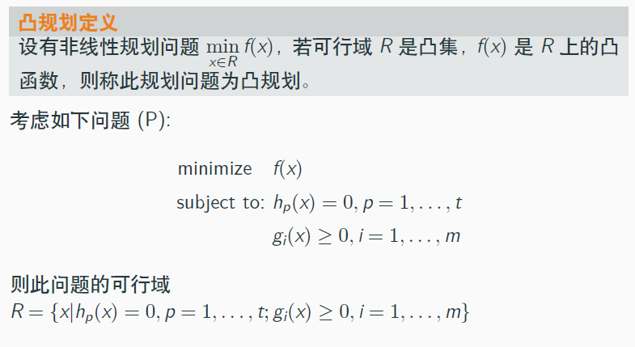
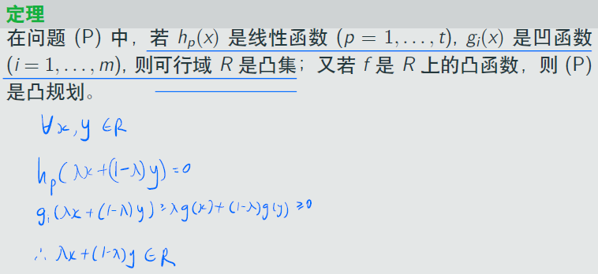
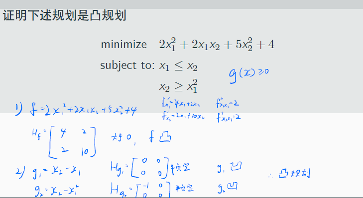
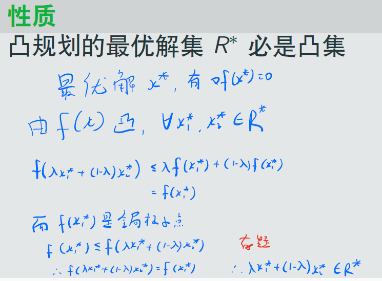
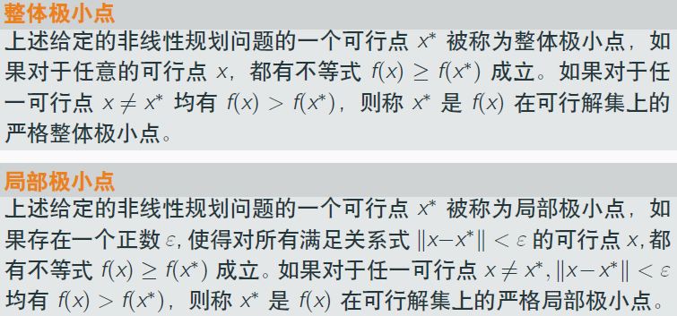
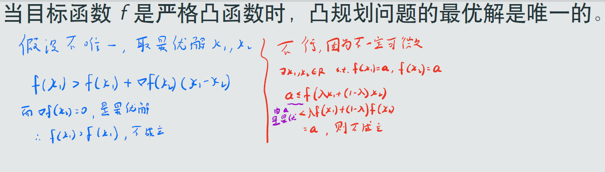

# 凸函数的极值和凸规划
## 凸函数的极值

分析：
- 凸集的凸函数的极小值点就是全局极小值点
- 上面的反证法中，矛盾的是$<f(x^*)$的小于号$<$

## 凸规划

几个注意的地方：
- 目标取minimize
- 因此不等约束是$g(x)\ge 0$的形式

### 定理：由f、g、h凹凸性得是否为凸规划

该定理的应用如下。

### 证明：凸规划的最优解集必是凸集

上述证明存在问题，因为应用了$\nabla f(x^*)=0$，而$f$未必可微...经过讨论，发现并没有应用到$\nabla f(x^*)=0$，因此证明没有问题。

### 线性规划的整体最小点与局部极小点

### 凸规划局部极小点性质
#### 性质1：凸规划的任一局部极小点即为整体极小解
#### 性质2：当目标函数f是严格凸函数时，凸规划问题的最优解是唯一的

如上，蓝色是我的证明，红色的老师的证明：
- 蓝色的不对，因为应用了$\nabla f(x^*)=0$，而$f$未必可微；
- 而红色的反证法中，产生矛盾的是$<$符号
- 注意应用取最小值点$f(x_1)=a$，所以$\forall x, a \le f(x)$这条性质
