# 最优性的充要条件、无约束极小化问题、一般非线性规划问题
## 无约束极小化问题
### 定义：无约束极小化问题
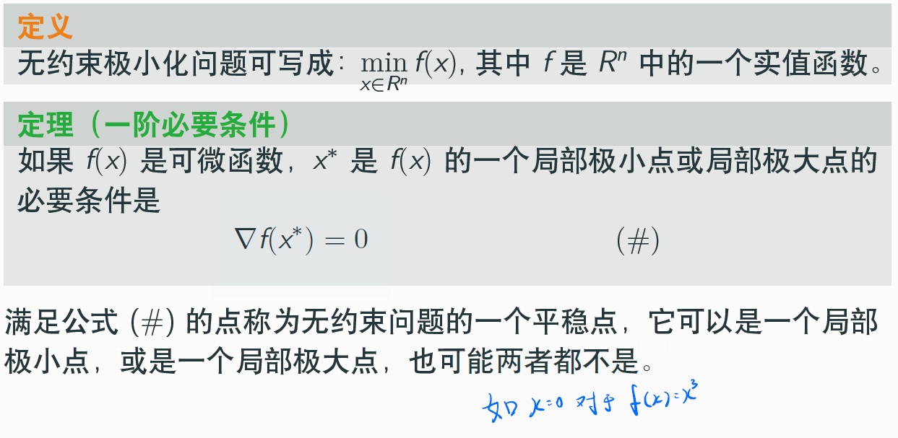

分析：
- 上面规定了无约束极小化问题的一般形式
- 注意，`平稳点`（一阶导为零）未必是局部极值点

### 定理：二阶必要条件
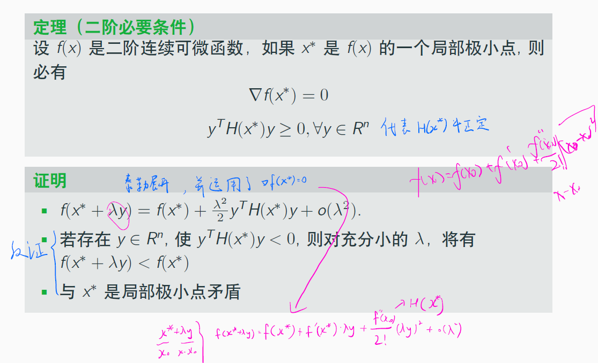

分析：
- 如果是局部极小点，那么必有什么条件
- 在上图证明中，应用了泰勒展开和平稳点性质$\nabla f(x^*)=0$

### 定理：二阶充分条件
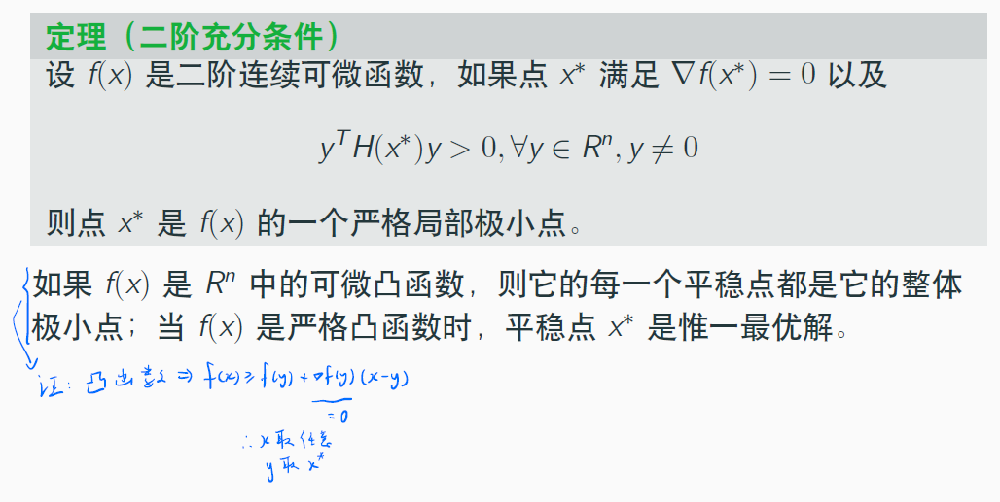

分析：
- 如何证明是严格局部极小值
- 该定理可以用凸函数等价条件轻松证明

## 一般非线性规划问题
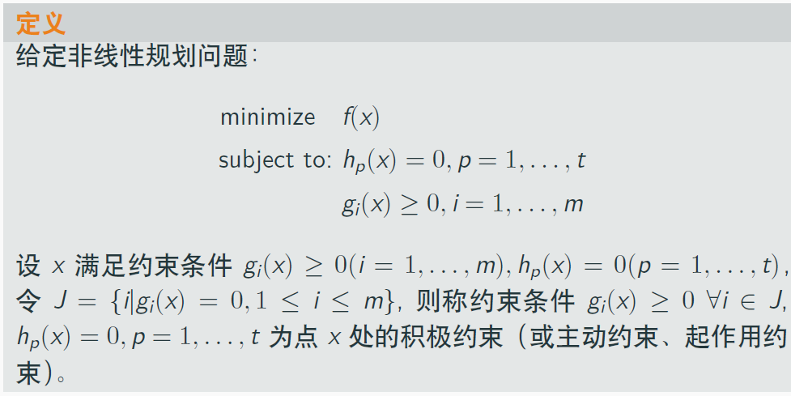
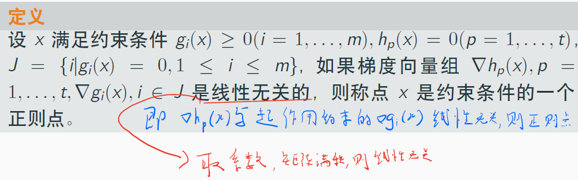

分析：
- 起作用的约束为`积极约束`（可想想象凸集中贴着边缘）
- $h$与起作用的$g$线性无关，则为`正则点`
- 这很好理解，可以想象在空间中，$x$为了取得能取到的最优值，努力贴近约束边缘（起作用的$g$）的样子

### KKT一阶必要条件
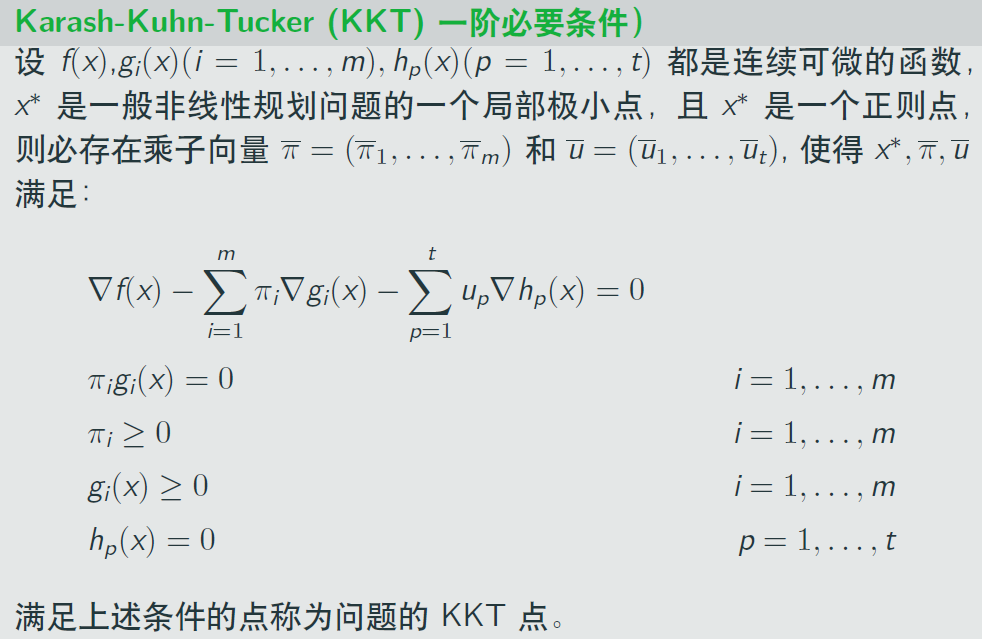

上述是一个基本的KKT条件，其逆（如果KKT点，则是最小值点）不一定成立。

但是，如果满足以下条件`（f凸、h线性、g凹）`，则成立。

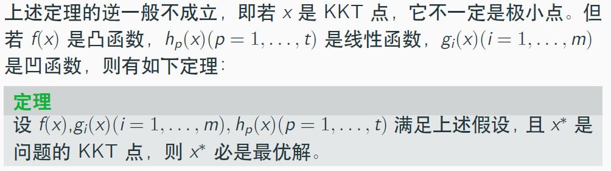

你会发现这和拉格朗日中的约束很像。

#### 证明：KKT条件
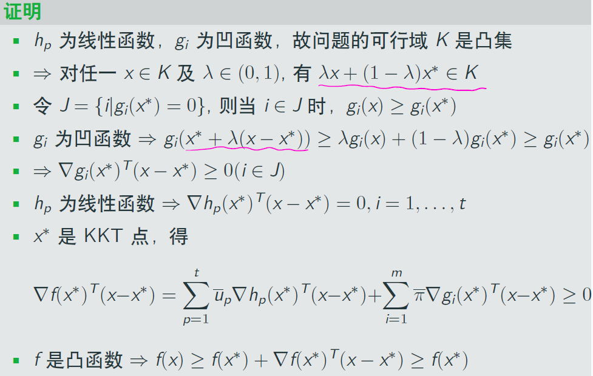

思路为（与证明过程顺序是逆过来的）：
- 为了证明$f(x^*)$必是最优解，即为了得出$f(x)\ge f(x^*)$
- 考虑使用凸函数不等式$f(x)\ge f(x^*) + \nabla f(x^*)^T (x-x^*)$
- 考虑在上式中消去$\nabla f(x^*)^T (x-x^*)$
- 用KKT来构造，分别从与$\nabla f(x^*)^T (x-x^*)$有关的$\nabla h_p(x^*)^T (x-x^*)$以及$\nabla g_i(x^*)^T (x-x^*)$下手

## 例题：必考题求KKT点
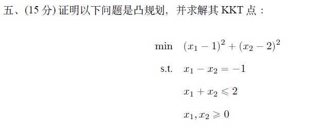
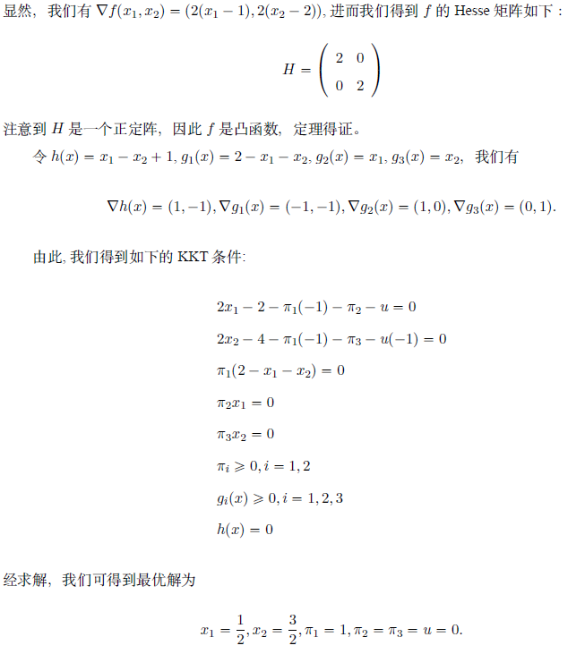

如上，要注意：
- 不管题目里提没题“证明是凸规划”，一定要先验证一下是不是凸规划
- 求解时，所有变量都是变量，平起平坐，此外，对于乘积为0的等式，分别讨论谁等于0是个不错的选择
- 一旦遇到可行解，则停下，必是最优解

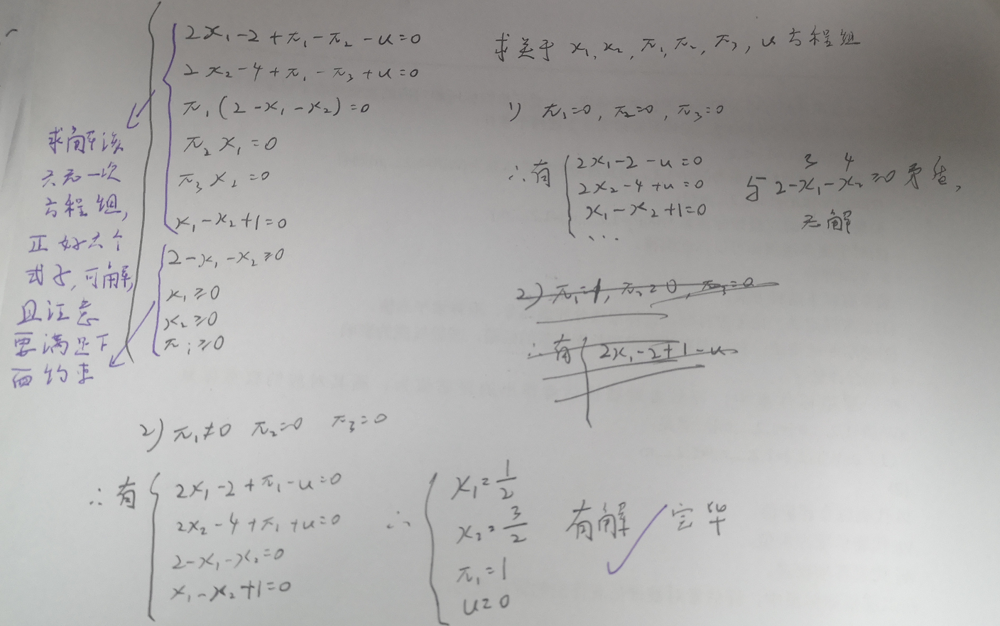
