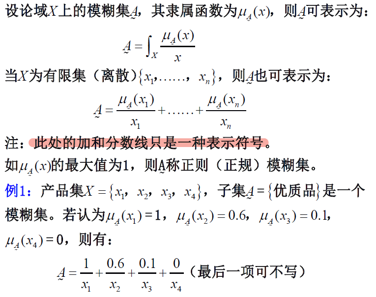
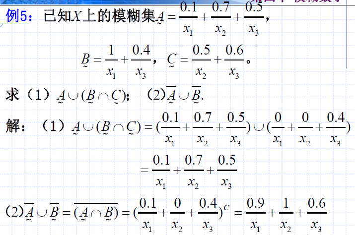

# 模糊现象与模糊集、隶属函数、模糊集的运算、水平截集与分解定理
## 模糊现象与模糊集
一个概念，有它的内涵与外延：
- 内涵：符合此概念的对象所具有的共同属性
- 外延：符合此概念的对象的全体

可见，一个概念的外延是一个集合，是符合此概念内涵的对象的全体组成的集合。

有些概念，其外延是清楚的，如男人、女人。而有些概念，其外延不很清楚，如青年人、老年人。

模糊集—边界不清楚的集合。反之为清晰集（普通集）。例如：雨天是清晰集（普通集），而晴天是模糊集；青年人、老年人也是模糊集。事实上，“青年”变为“老年”是一个连续的过程。因此，处于中间过渡阶段年龄的人，自然就具有“亦此亦彼”的属性。我们把这种属性称为：
- 模糊性：客观事物的差异性在中介过渡时所呈现的“亦此亦彼”性。
- 模糊数学：研究和处理模糊性现象的数学分支。

## 模糊集的隶属函数
### 隶属函数的概念

如上，在讨论模糊集具体概念前，应首先了解隶属的概念：
- 对于正常集合，隶属度不是1就是0
- 对于模糊集，隶属的是一个元素属于$[0,1]$的数字

### 模糊集的表示

如上，这里记录模糊集的当时是使用`+`与`分数线`，但并不是指加法的意义，只是一种较为明确的记录方式（相当于在这里做了运算符重载）。

在上图的例子中：
- 产品有 4 个值（不是4个维度，而是4个产品/元素）
- 其子集是一个模糊集（是不是优质品），因此可以有$A_\sim$如上的表示方法，其中，隶属度为0的元素可以省略不写

### 隶属函数的确定
- 德尔菲法（专家打分）
- 模糊统计法（调查）

如上是界定一个连续变量$x$在两个模糊集的隶属度函数。

## 模糊集的运算
### 运算定义

我们可以看出，模糊集具体的表现，是由其隶属函数决定的。因此，模糊集的运算主要也是看其隶属函数的运算。

#### 例题：模糊集运算

分析：知道两个函数大概形状，求交点，按照定义就好。

### 运算律

分析：
- 对于证明，我们也一定是根据运算定义，拆解称隶属函数之间的关系
- 对于分配律，我们可以假定$\mu_B \ge \mu_C$（因为$B$与$C$是对称的），这样只需要讨论三种情况：$\mu_A \ge \mu_B \ge \mu_C$、$\mu_B \ge \mu_A \ge \mu_C$、$\mu_B \ge \mu_C \ge \mu_A$

#### 例题：模糊集运算律应用

## 模糊集的水平截集与分解定理
### 水平截集

分析：
- 注意截集$A_\lambda$是一个普通集合（不是模糊集）
- 注意截集是`向上截`，隶属度$\mu(x)$大于$\lambda$取这个$x$

#### 例题：水平截集

分析：
- 都是单调函数，因此求交点就可以确定截集了
- 截集的意义为：隶属的`程度`不低于$\lambda$

### 分解定理

分析：
- 第一次看有些费解，但是我们可以抛开公式，仅从`分解`二字来理解
- 其意义为：模糊集可以`分解`为：若干截集乘上相应的$\lambda$；因为截集就是把元素大于$\lambda$的元素都拿走
  - 并且隶属度本该是$\mu \ge \lambda$的，在截集中都是$1$了
  - 那么，将截集拼回去（拼成原本的模糊集）则是用$\lambda$乘回$1$得到本来的隶属度函数

这个证明过程是：
- $\lambda$在$\lambda > \mu(x)$时，取并集
- 就是帮助$\lambda$乘回其对应的截集的部分，取到该$x$其原本对应的隶属度
