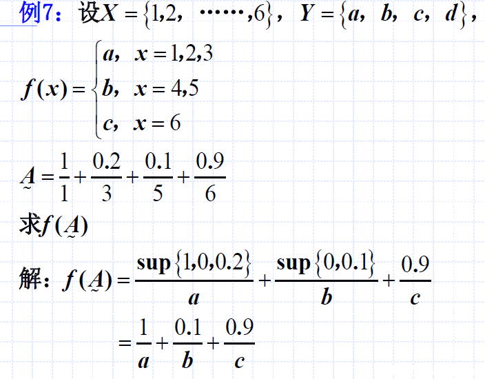
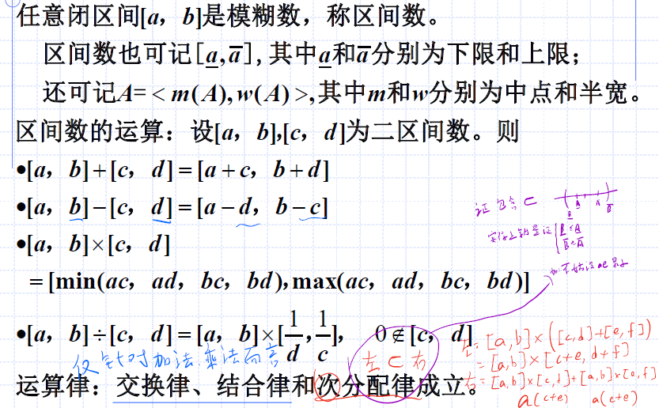

# 扩张原理、模糊数、可能性分布与模糊概率
## 扩张原理

如上，对于非模糊集：
- 我们可以通过一个映射$f$将$x$映射到$y$上去
- 如果$x_1$与$x_2$都映射到$y$，但是$x_1$不属于$X$、$x_2$属于$X$、$y$属于$Y$
- 则依旧，有事实：$\mu_{f(X)} (y)=1$，$\mu_A (x_1)= 0$，$\mu_A (x_2)= 1$
- 因此可以得到普通集合上的`映射的隶属度函数关系`：$\mu_{f(A)}(y)=\vee_{f(x)=y}\mu_A (x)$

所以我们推导出模糊集上的`扩张原理`。

#### 例题：扩张原理

如上，这是一个运算（映射）后，取原x隶属度上界的过程。

#### 多元扩张原理

## 模糊数
### 凸模糊集

我的理解：取任一区间上的点，隶属度总是至少大于等于一个区间端点的隶属度。（没有向下凹陷的部分）

#### 性质1：凸模糊集任意截集是一个区间

注意`一个`区间。

分析：
- 这个性质直观来想很好理解：没有向下凹陷，则取截集，肯定是一个，不是多个（不会被向下凹陷分隔开）

#### 性质2：凸模糊集并集是凸模糊集

如上，直接代入定义，验证公式即可。

### 模糊数定义与几何表示

注意：
- 正则模糊集要求：最大隶属度要为1
- 截集是闭区间
- `模糊数是一个模糊集`
- 目前可以理解为模糊数与凸模糊集相同

### 区间数

上面的`区间数`运算律要注意：
- 减法要反转被减数
- 乘法取四个乘积的最小与最大
- 除法变成乘法时，依旧要反转除数（为了保证是一个区间，左边小于等于右边）

#### 证明：区间数运算服从次分配律
`次分配律`：即左边$A(B+C)$属于右边$AB + AC$的分配率。你可以如上图把左右都乘开，然后假设、讨论区间大小（包含关系）；也可以从微观证明（与同学讨论，同学教我的办法）。

#### 例题：区间数的运算

直接代入运算律就可以。用于检验是否有根，是一个神奇的应用，如果有深入的必要，可以在日后学习中探究区间数运算的原理。

### 模糊数的运算

如上，元素也要两两进行运算：
- 元素合并时取交集
- 合并后整理公式，取并集
- 看例题就了然了

#### 例题：模糊数的运算

## 可能性分布与模糊概率
### 随机性与可能性

这里，将可能性与随机性结合了起来。

### 可能性分布

如上，可能性分布就是隶属度。

### 模糊事件的概率

这里多少令人有些费解：
- 本身是存在射击命中率的（每次射击是独立的）
- 而对于“设了几次就射中目标”这件事，我们需要用模糊集$A_\sim$描述这个“不几次”
- 射了1次，当然属于“不几次”；设了2次，属于“不几次”的程度为0.9...设了5次及以上，当然不算是“不几次”，隶属度均为0。
