# 模糊关系与模糊矩阵、模糊关系的运算与合成、模糊等价关系
## 模糊关系与模糊矩阵
### 定义：模糊关系
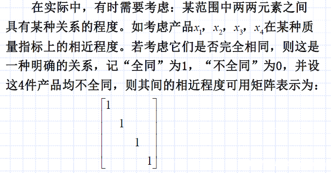
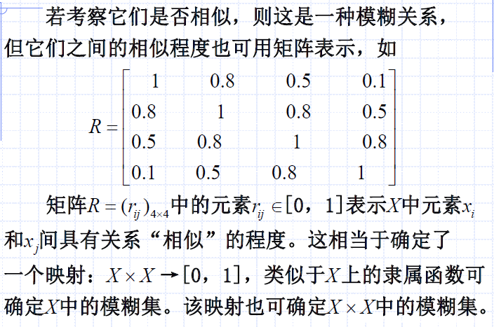

如上，我们使用方阵描述“两两之间的相近关系”，其中“全同”记为1，“不全同”（我认为叫做`“全不同”`更准确一些）记为0。那么，一定有对角线元素为1（自己跟自己全同）。

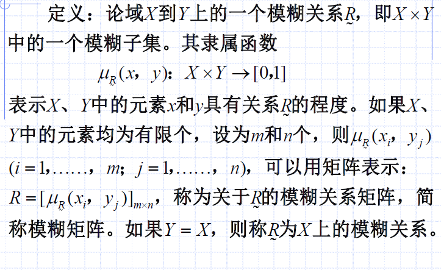

如上是$X$上模糊关系的定义：
- 当$Y=X$时，表示从自己到自己上的相似/关系程度
- 此时，也是方阵

### 模糊矩阵的截集
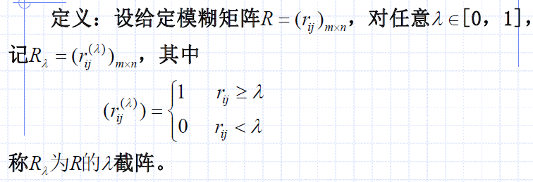

同样，截集作用后，只截上半段，得到的是普通集合（元素不是0就是1）。

例题也很直观。

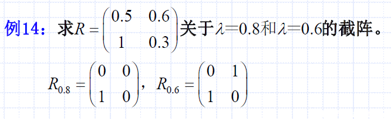

## 模糊关系的运算与合成
### 模糊关系的运算
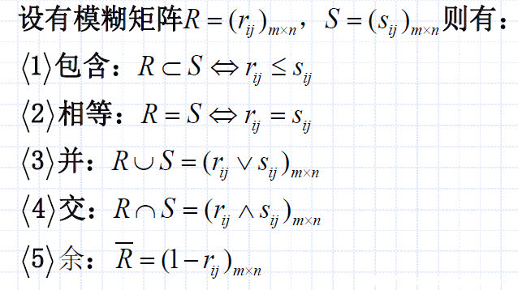

如上运算有这个特点：
- 矩阵间对应位置元素的两两运算

### 模糊矩阵乘积（合成）
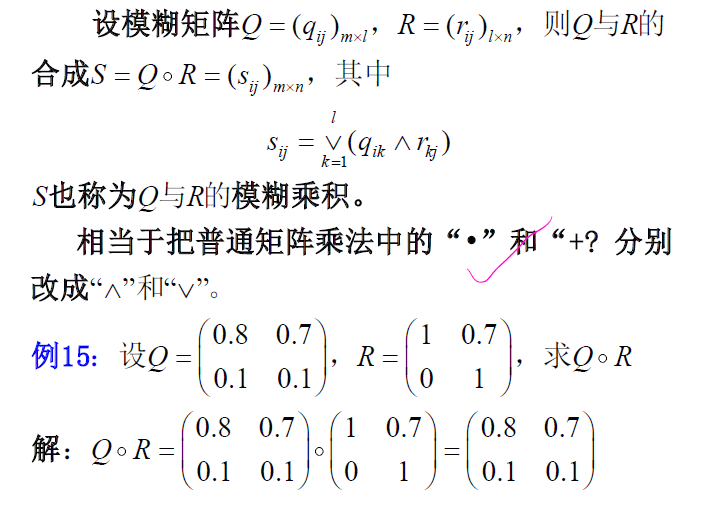

合成运算类似矩阵乘积：
- 只不过将乘法变为了$\wedge$合取运算
- 将加法变成了$\vee$析取运算

## 模糊等价关系
### 定义：模糊等价关系（三条性质）
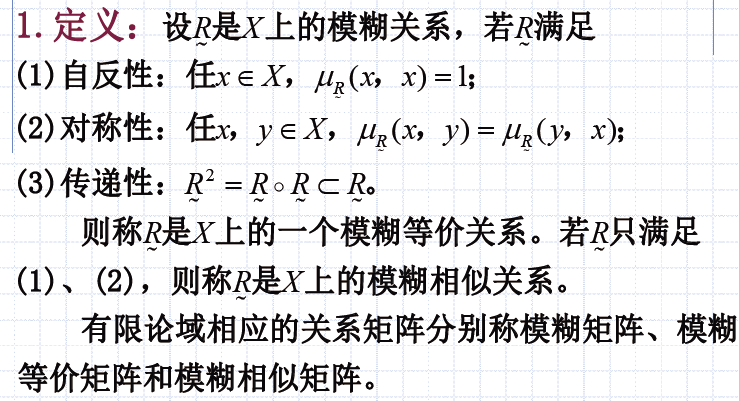

如上，应注意：
- `模糊等价关系`是`模糊相似关系`的特殊形式
- `模糊等价关系`具有相似性$R^2 = R \cdot R \subset R$的特点（对自己平方，更小了），要求更为苛刻

### 性质：模糊相似阵与模糊等价阵
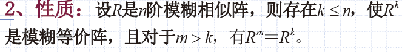

如上，应注意：模糊相似阵总能通过对自己平方，变成模糊等价阵。

### 例题：模糊相似阵与模糊等价阵
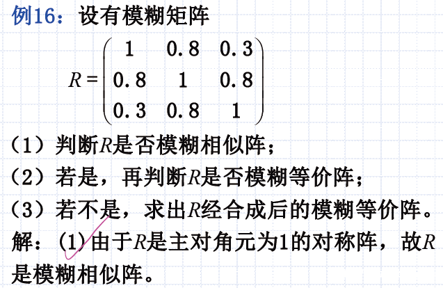
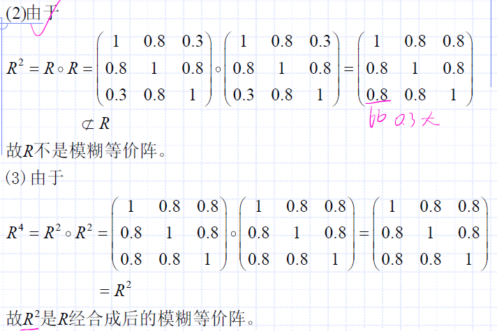

分析：
- 是否为`模糊相似阵`？是否满足`自反性`与`对称性`
- `模糊相似阵`是否为`模糊等价阵`？是否满足`传递性`
- 由性质`模糊相似阵总能通过对自己平方，变成模糊等价阵`我们可以尝试验证$R^2$是不是模糊等价阵，还真的是。于是我们合成后的模糊等价阵即为$R^2$
