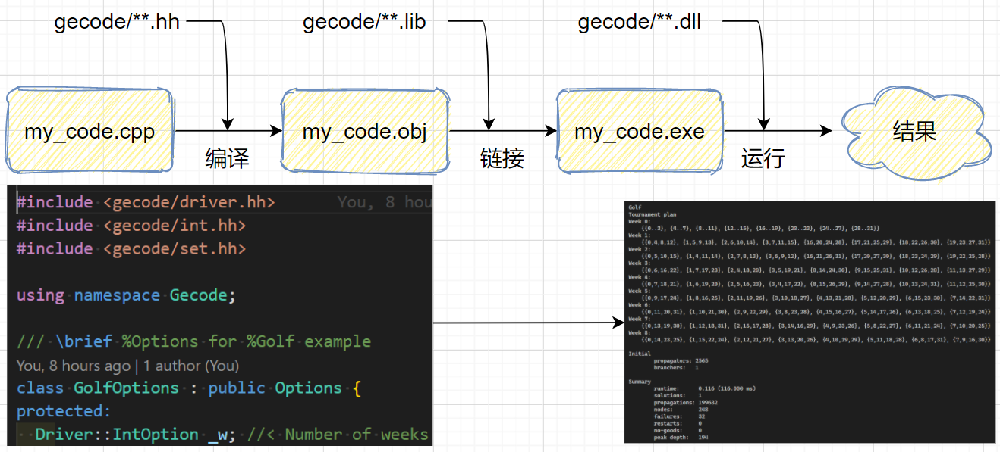

# Gecode 中文笔记
本笔记将以 Gecode 官方使用手册《Modeling and Programming with Gecode》为主要参考资料，结合笔者自身实践经验，提供中文的 Gecode 入门参考。

本笔记的重点在于『工具的使用』，也就是说，要求读者：
- 具有基本的运筹算法、数学优化方法知识（如分支定界法算法过程）；
- 能看得懂基本的 C/C++ 程序（了解到面向对象中如何继承）。

## 目录
<!-- @import "[TOC]" {cmd="toc" depthFrom=1 depthTo=6 orderedList=false} -->

<!-- code_chunk_output -->

- [Gecode 中文笔记](#gecode-中文笔记)
  - [目录](#目录)
  - [笔记索引](#笔记索引)
  - [预装环境](#预装环境)

<!-- /code_chunk_output -->

笔记、资源以及用到的代码均放在 GitHub 仓库里：
- Github: [PiperLiu/math_codes_economics_management/gecode_MPG_notes](https://github.com/PiperLiu/math_codes_economics_management/tree/master/gecode_MPG_notes)
- Gitee: [Piper/math_codes_economics_management/gecode_MPG_notes](https://gitee.com/piperliu/math_codes_economics_management/tree/master/gecode_MPG_notes)

## 笔记索引
| 题目 | 链接 | 难度 |
|---|---|---|
| Gecode是什么？运行实例 | [link](./notes/01Gecode是什么？使用示例？笔记说明.md) | ★☆☆ |
| Gecode安装 | [link](./notes/02Gecode安装.md) | ★☆☆ |

## 预装环境
C/C++ 的环境和外部依赖并不像 python 这种语言，要引入外部依赖（配置环境）、运行成功并不容易。但总体说来，实际上就是三步，以 MSVC 编译器为例：
- 我们写好了 cpp 文件，然后用编译器编译它（可能会引入头文件 h 等），得到 obj 文件
- 我们将 obj 文件与静态链接库 lib 文件链接，得到可执行 exe 文件
- 我们将 exe 文件执行，其中可能涉及到调用动态链接库 dll 文件

所以，对于配置环境，无论是否是按照教程或者我的笔记安装的 gecode ，你的 debug 思路应该是：**明确哪一步缺什么，缺什么就补什么。**

首先明确我的环境与平台，至于具体怎么装的 gecode 以及具体安装思路，我将在第二篇笔记中说明。

| 类别 | 工具 | 备注 |
|---|---|---|
| 操作系统 | windows 10 | 19041.867 |
| C/C++ | VC++ 2019 | 用于 x64 的 Microsoft (R) C/C++ 优化编译器 19.28.29912 版 |
| gecode | gecode | Gecode-6.2.0-x64-2017.msi https://www.gecode.org/download.html |
| 编辑器 | VS Code | 版本没关系，就是写写代码而已 |
| 命令行 | powershell | 版本没关系，只不过我喜欢写一些 ps1 脚本 |
