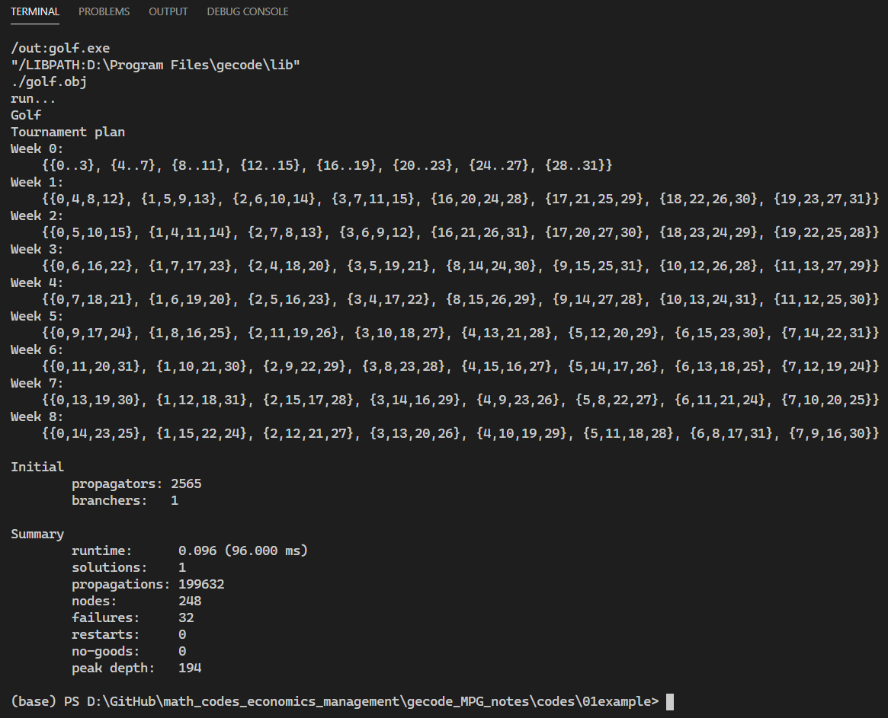
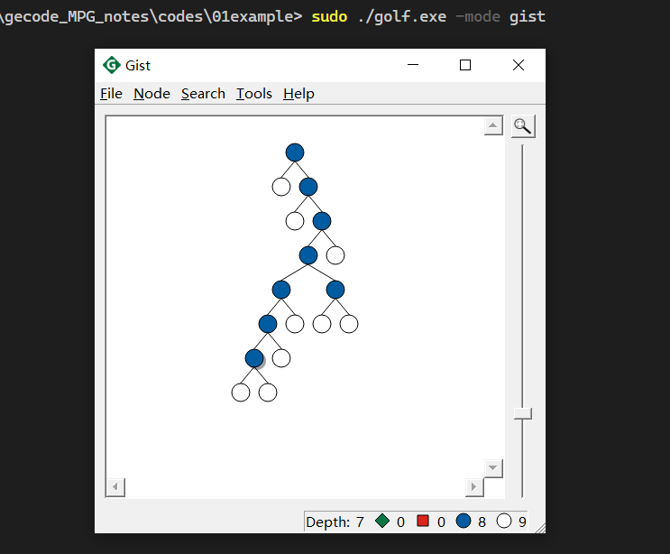

# 01Gecode是什么？使用示例？笔记综述

<!-- @import "[TOC]" {cmd="toc" depthFrom=1 depthTo=6 orderedList=false} -->

<!-- code_chunk_output -->

- [01Gecode是什么？使用示例？笔记综述](#01gecode是什么使用示例笔记综述)
  - [参考资料](#参考资料)
  - [Gecode 是什么？](#gecode-是什么)
  - [Gecode 能做什么？使用示例](#gecode-能做什么使用示例)
  - [笔记综述](#笔记综述)
- [笔记地址](#笔记地址)

<!-- /code_chunk_output -->

## 参考资料
主要参考 Gecode 的官方说明书《MPG》：
- 全称 Modeling and Programming with Gecode
- GitHub 仓库在这里：[https://github.com/Gecode/MPG](https://github.com/Gecode/MPG)
- 我已经把 pdf 版本放在本笔记仓库中了：[MPG.pdf](../resources/MPG.pdf)

## Gecode 是什么？
Gecode 按照官方说明：an open, free, portable, accessible, and efficient environment for developing constraint-based systems and applications.

我的概括：**基于 C++ 的约束模型求解工具。**

Gecode 特性：
- 开源免费：[https://github.com/Gecode](https://github.com/Gecode)
- 有图形化界面辅助理解

## Gecode 能做什么？使用示例
我现在跑一个 gecode 的例子，就使用官方提供的 golf 。

代码放在 [../codes/01example/golf.cpp](../codes/01example/golf.cpp) 里面了。

**请将 gecode_MPG_notes/codes 作为工作路径打开项目，然后在 powershell 中执行语句：**
```powershell
cd 01example
run golf
```

命令行将输出求解结果。



此时生成 golf.exe ，输入：
```powershell
./main.exe -mode gist
```

将产生 gist 界面，可视化搜索求解过程。



## 笔记综述
本笔记将以 Gecode 官方使用手册《Modeling and Programming with Gecode》为主要参考资料，结合笔者自身实践经验，提供中文的 Gecode 入门参考。

# 笔记地址
笔记、资源以及用到的代码均放在 GitHub 仓库里：
- Github：[PiperLiu/math_codes_economics_management/gecode_MPG_notes](https://github.com/PiperLiu/math_codes_economics_management/tree/master/gecode_MPG_notes)
- Gitee:[Piper/math_codes_economics_management/gecode_MPG_notes](https://gitee.com/piperliu/math_codes_economics_management/tree/master/gecode_MPG_notes)