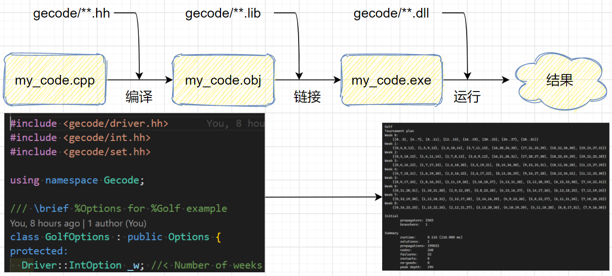

# Gecode的安装

<!-- @import "[TOC]" {cmd="toc" depthFrom=1 depthTo=6 orderedList=false} -->

<!-- code_chunk_output -->

- [Gecode的安装](#gecode的安装)
  - [Linux 安装 gecode](#linux-安装-gecode)
  - [Windows 10 安装 gecode](#windows-10-安装-gecode)
- [笔记地址](#笔记地址)

<!-- /code_chunk_output -->

在 Linux 上，原生平台的 gcc/g++ 让安装变得舒适；但是在 windows 10 上，编译的过程似乎没有那么简单。

本文详述两点：
- Linux 下 gecode 安装
- Windows 10 下 gecode 安装（配合 Visual Studio 2019）

## Linux 安装 gecode

安装 gecode 前需要有 C/C++ 的编译环境，咱们直接安装：

```bash
sudo apt install gcc
sudo apt install gcc
sudo apt install make
sudo apt install cmake
```

下面把 github 上 gecode 的源码拉下来，准备编译安装。

```bash
git clone git@github.com:Gecode/gecode.git
```

然后我们进入 gecode 文件夹。

```bash
cd gecode
```

可以看到项目的结构是这个样子：

```bash
├─.github
│  └─ISSUE_TEMPLATE
├─.vscode
├─contribs
│  ├─qecode
│  │  └─examples
│  └─quacode
│      ├─doxygen
│      ├─examples
│      └─quacode
│          ├─qint
│          │  └─qbool
│          ├─search
│          │  └─sequential
│          └─support
├─doxygen
├─examples
├─gecode
│  ├─driver
│  ├─flatzinc
│  │  ├─exampleplugin
│  │  └─mznlib
│  ├─float
│  │  ├─arithmetic
│  │  ├─bool
│  │  ├─branch
│  │  ├─channel
│  │  ├─linear
│  │  ├─rel
│  │  ├─trace
│  │  ├─transcendental
│  │  ├─trigonometric
│  │  ├─var
│  │  ├─var-imp
│  │  └─view
│  ├─gist
│  │  └─standalone-example
│  ├─int
│  │  ├─arithmetic
│  │  ├─bin-packing
│  │  ├─bool
│  │  ├─branch
│  │  ├─channel
│  │  ├─circuit
│  │  ├─count
│  │  ├─cumulative
│  │  ├─cumulatives
│  │  ├─distinct
│  │  ├─dom
│  │  ├─element
│  │  ├─exec
│  │  ├─extensional
│  │  ├─gcc
│  │  ├─ldsb
│  │  ├─linear
│  │  ├─member
│  │  ├─no-overlap
│  │  ├─nvalues
│  │  ├─order
│  │  ├─precede
│  │  ├─rel
│  │  ├─sequence
│  │  ├─sorted
│  │  ├─task
│  │  ├─trace
│  │  ├─unary
│  │  ├─var
│  │  ├─var-imp
│  │  ├─view
│  │  └─view-val-graph
│  ├─iter
│  ├─kernel
│  │  ├─branch
│  │  ├─data
│  │  ├─memory
│  │  ├─propagator
│  │  └─trace
│  ├─minimodel
│  ├─search
│  │  ├─cpprofiler
│  │  ├─par
│  │  └─seq
│  ├─set
│  │  ├─branch
│  │  ├─channel
│  │  ├─convex
│  │  ├─distinct
│  │  ├─element
│  │  ├─int
│  │  ├─ldsb
│  │  ├─precede
│  │  ├─rel
│  │  ├─rel-op
│  │  ├─sequence
│  │  ├─trace
│  │  ├─var
│  │  ├─var-imp
│  │  └─view
│  ├─support
│  │  └─thread
│  └─third-party
│      └─boost
│          ├─config
│          │  ├─abi
│          │  ├─compiler
│          │  ├─no_tr1
│          │  ├─platform
│          │  └─stdlib
│          ├─detail
│          └─numeric
│              └─interval
│                  ├─compare
│                  └─detail
├─images
├─misc
│  └─doxygen
├─test
│  ├─assign
│  ├─branch
│  ├─flatzinc
│  ├─float
│  ├─int
│  └─set
└─tools
    └─flatzinc
```

我们根据说明书直接编译按照就好。首先在命令行中自动运行配置的相关脚本。

```bash
./configure
```

如果希望禁用某个模块，可以进行如下的参数配置：

```bash
./configure --disable-gist  # 禁用 gist
```

配置成功后，就可以编译了：

```bash
make
```

编译好后，可以输入如下命令，将其安装：

```bash
make install
```

回过头来，我们还是看下面这张图。



如果上述过程都顺利进行，没有 ERROR 的话，此时你运行 gecode 中的一个示例程序，比如你在 gecode 文件夹下输入 `./examples/bin-packing` 报错了，那么，**大概率是缺少 include 或者 lib 文件。注意上图，include 和 lib 分别是干什么的。**

你可以手动找到 gecode 的头文件或 lib 被你安装到哪里去了，然后将其路径添加到环境变量，或者在每次编译时，带上它，比如我的编译命令就是：

```bash
g++ -I "D:/Program Files/gecode/include" ./$filename.cpp
```

`-I D:/Program Files/gecode/include` 就表示，告诉编译器：去 `D:/Program Files/gecode/include` 下面找一找，有没有我们要的头文件 `gecode/**.hh` 。

**我不可能把所有 debug 方法都写在这里，但是万变不离其宗，现在你知道了编译的过程，起码相当于半个医生，遇到了错误，可以自己去网上检索，比如：**
- g++ 如何添加 include ？
- g++ 如何添加 lib ？
- ...

## Windows 10 安装 gecode
我尝试过在 windows 10 编译以及在 Cgywin 编译，都失败了。于是使用最朴素的方式，安装官网的要求，下载安装包 .msi 文件，然后通过 MSVC 使用。

首先安装 Visual Studio ，我去官网下载，默认的版本是 2019 版的。下载。

然后我们安装 VC++ （就是在 installer 里选择 C++ 安装）。


此时我们已经有了编译器 MSVC 。接下来下载 gecode ，然后安装：
- https://www.gecode.org/download.html
- 下载 [Gecode-6.2.0-x64-2017.msi](https://github.com/Gecode/gecode/releases/download/release-6.2.0/Gecode-6.2.0-x64-2017.msi)

安装这个 .msi 安装包，记住你把 gecode 安装在哪里了哈，比如我就放在了 `D:/Program Files/gecode` 。

以后我们使用 gecode 时，使用 MSVC 的编译器就好。一般来讲，我们把这个编译器路径放在我们的环境变量中。

我的 VS 放在 D 盘 `D:\Program Files\Microsoft Visual Studio` ，我沿着文件夹找到了编译器地址：
- D:\Program Files\Microsoft Visual Studio\2019\Enterprise\VC\Tools\MSVC\14.28.29910\bin\Hostx64\x64
- 我用的是企业版 Enterprise 的，这个无所谓

接着我们把上述路径放在环境变量 Path 里（不知道没关系，自己检索`win10如何设置环境变量`）。

此外，我们还要新建环境变量 INCLUDE 和 LIB 供 MSVC 寻找其自带的 INCLUDE 和 LIB ，如下两张图。


**注：首次添加环境变量时，可能只能输入一条，你可以输入`;`，来将其变为列表，再点开这个环境变量后，你所见到的就是一个列表了，可以新建、编辑多条值。**

之后，我们就可以如说明书上畅快地编译玩耍了：

```powershell
# 编译
cl /DNDEBUG /EHsc /MD /wd4355 -I "D:\Program Files\gecode\include" -c ./$filename.obj -Tp ./$filename.cpp

# 链接
cl /DNDEBUG /EHsc /MD /wd4355 -I "D:\Program Files\gecode\include" -Fe ./$filename.obj /link /LIBPATH:"D:\Program Files\gecode\lib"

# 运行
sudo ./$filename.exe
```

# 笔记地址
笔记、资源以及用到的代码均放在 GitHub 仓库里：
- Github: [PiperLiu/math_codes_economics_management/gecode_MPG_notes](https://github.com/PiperLiu/math_codes_economics_management/tree/master/gecode_MPG_notes)
- Gitee: [Piper/math_codes_economics_management/gecode_MPG_notes](https://gitee.com/piperliu/math_codes_economics_management/tree/master/gecode_MPG_notes)