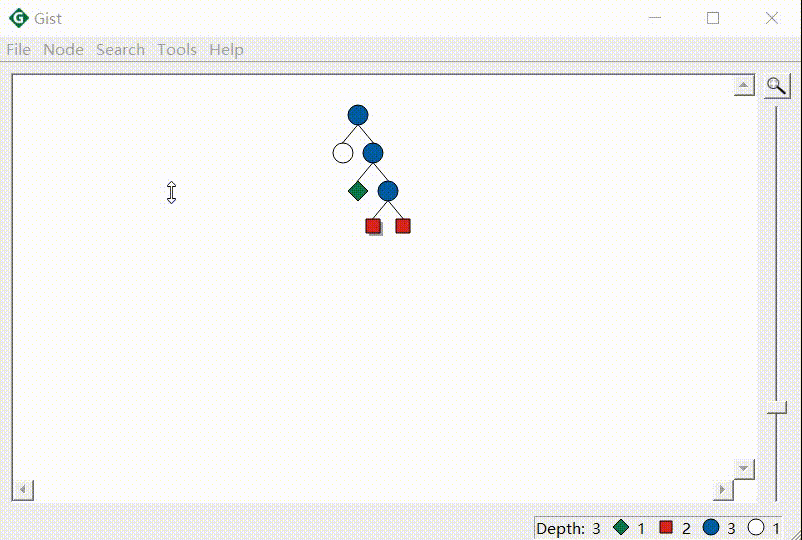
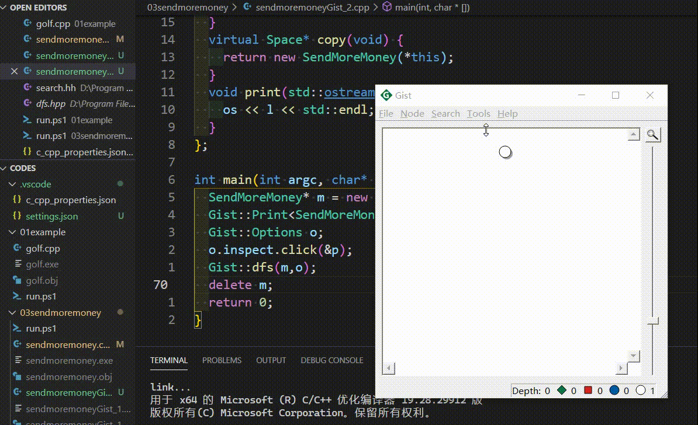

# Gecode基础知识

<!-- @import "[TOC]" {cmd="toc" depthFrom=1 depthTo=6 orderedList=false} -->

<!-- code_chunk_output -->

- [Gecode基础知识](#gecode基础知识)
  - [以SendMoreMoney为例](#以sendmoremoney为例)
    - [SendMoreMoney](#sendmoremoney)
    - [必须注意的点](#必须注意的点)
    - [rel - 关系约束](#rel-关系约束)
    - [distinct - 两两不同约束](#distinct-两两不同约束)
    - [branch - 定义分支规则](#branch-定义分支规则)
    - [关于 print](#关于-print)
  - [搜索引擎的使用](#搜索引擎的使用)
  - [异常处理](#异常处理)
  - [Gist - 可视化求解过程](#gist-可视化求解过程)
  - [设定目标值](#设定目标值)
- [笔记地址](#笔记地址)

<!-- /code_chunk_output -->

## 以SendMoreMoney为例

### SendMoreMoney

我们给这八个字母赋值（赋一个数字）：S E N D M O R Y

使得等式成立：SEND + MORE = MONEY ，其中每个字母是不同的数字。

还不明白？告诉你答案，我们最后要把 SEND + MORE = MONEY 替换为 9567 + 1085 = 10652 。这就是求解成功了，其中 S 是 9 、 E 是 5 ...

### 必须注意的点

代码在：[../codes/03sendmoremoney/sendmoremoney.cpp](../codes/03sendmoremoney/sendmoremoney.cpp)

```cpp
// 使用整数变量和整数约束
// 我们需要 include gecode/int.hh 头文件
#include <gecode/int.hh>
// 使用搜索引擎（求解逻辑），我们需要 gecode/search.hh 头文件 
#include <gecode/search.hh>

// 所有的 gecode 功能都在命名空间 Gecode 里
// 所以，避免 Gecode::IntVarArray 这样的麻烦
// 我们 using namespace Gecode; 来简化代码
using namespace Gecode;

// 所有的模型都要继承 Gecode::Space
class SendMoreMoney : public Space {
protected:
  // 这里声明了一个整数变量数组 l
  IntVarArray l;
public:
  // 在构造函数里声明模型
  // l(*this, 8, 0, 9) 表示：
  //   - 变量数组 l 是这个模型的（this）
  //   - 变量数组 l 包含 8 个变量
  //   - 这些变量的取值范围是 [0, 9]
  SendMoreMoney(void) : l(*this, 8, 0, 9) {
    // 我们声明了一些变量
    IntVar s(l[0]), e(l[1]), n(l[2]), d(l[3]),
           m(l[4]), o(l[5]), r(l[6]), y(l[7]);
    // 下面是一些约束的实现，先不用管具体含义
    // no leading zeros
    rel(*this, s, IRT_NQ, 0);
    rel(*this, m, IRT_NQ, 0);
    // all letters distinct
    distinct(*this, l);
    // linear equation
    // 这里是一些 Args 变量
    // 我把 Var 理解为决策变量，或者自变量
    // 而 Args 是根据 Var 变动的，中介变量
    // 本身并不主动变化，受 Var 们变动影响
    IntArgs c(4+4+5); IntVarArgs x(4+4+5);
    c[0]=1000; c[1]=100; c[2]=10; c[3]=1;
    x[0]=s;    x[1]=e;   x[2]=n;  x[3]=d;
    c[4]=1000; c[5]=100; c[6]=10; c[7]=1;
    x[4]=m;    x[5]=o;   x[6]=r;  x[7]=e;
    c[8]=-10000; c[9]=-1000; c[10]=-100; c[11]=-10; c[12]=-1;
    x[8]=m;      x[9]=o;     x[10]=n;    x[11]=e;   x[12]=y;
    linear(*this, c, x, IRT_EQ, 0);
    // 定义了分支定界的规则
    // post branching
    branch(*this, l, INT_VAR_SIZE_MIN(), INT_VAL_MIN());
  }
  // 必须声明一个 copy constructor
  // 其中一定一定要有对于变量的更新
  // search support
  SendMoreMoney(SendMoreMoney& s) : Space(s) {
    l.update(*this, s.l);
  }
  // 以及声明一个 copy 方法（用于search）
  virtual Space* copy(void) {
    return new SendMoreMoney(*this);
  }
  // print solution
  void print(void) const {
    std::cout << l << std::endl;
  }
};

// main function
int main(int argc, char* argv[]) {
  // create model and search engine
  SendMoreMoney* m = new SendMoreMoney;
  DFS<SendMoreMoney> e(m);
  delete m;
  // search and print all solutions
  while (SendMoreMoney* s = e.next()) {
    s->print(); delete s;
  }
  return 0;
}
```

如上，我们实现了一个问题，我在中文注释中做出了解释。值得注意的有：
- 所有的 gecode 功能都在命名空间 Gecode 里
- 所有的模型都要继承 Gecode::Space
- 除了基本的构造函数，必须声明一个 copy constructor 、以及声明一个 copy 方法（用于search）
- **我们必须在 copy constructor 对决策变量进行更新**（比如 `l.update(*this, s.l);`），这尤为重要，否则程序不会报错，而求解过程是错误的。原因在于，我们的求解器在求解过程中，会不断赋值 Space 实例，如果不在 copy constructor 中更新决策变量，则无法进行回溯、保存等操作

我把 Var 理解为决策变量，或者自变量；而 Args 是根据 Var 变动的，中介变量，本身并不主动变化，受 Var 们变动影响。

注意到无论是变量还是约束，其声明时，第一个参数都 `*this` 。**你可以如此理解：变量如小孩子，小孩子出生，必须明确 ta 的监护人是谁，否则，接下来小孩子没有依靠，这个小孩子也就活不下去。在这里，我们的变量和约束都依靠其存在的问题中，即类 SendMoreMoney 。**

### rel - 关系约束
```cpp
rel(*this, s, IRT_NQ, 0);
```

上述语句表示：变量 s 不等于 0，其中：
- `IRT_NQ` 表示不等于，我们将在后文见到所有的逻辑符号表达
- rel 是 relation 的意思

### distinct - 两两不同约束
```cpp
distinct(*this, l);
```

我们这里不具体阐述 distinct 的用法，只说明其作用：
- l 数组中变量要两两不同（pairwise different）

其他约束不再详述，以后会提到。

### branch - 定义分支规则

在求解过程中，不同的搜索方式对于求解效果有着天差地别的影响。因此定义合适的 branch 分支规则尤为重要。

```cpp
branch(*this, l, INT_VAR_SIZE_MIN(), INT_VAL_MIN());
```

这里表示，对于变量数组 l 中的变量，我们首先选择对其中搜索范围最小的变量进行搜索（INT_VAR_SIZE_MIN()），此外如果选择了一个变量，我们将现有的最小值赋给它（INT_VAL_MIN()）。

其他规则以及关于 branch 的用法将在后文讨论。

### 关于 print

在求解后， gecode 会自动调用 print 输出。我们可以自由发挥，重载 print 函数，让解是我想要的形式。

```cpp
// print solution
void print(void) const {
std::cout << l << std::endl;
}
```

求解后的效果：
```cpp
{9, 5, 6, 7, 1, 0, 8, 2}
```

表示 S 是 9 、 E 是 5 ...

## 搜索引擎的使用

我们在上面定义了我们的问题（包含变量与约束），我们在程序中称之为一个“模型`model`”。

这个模型对象中存储了当前变量的范围，我将其理解为搜索中的一些节点的集合（在一些运算后产生的更小的、更精准的解空间）。

那么如何实现一颗搜索树呢？在 `main` 方法中，我们将其实现。

```cpp
// main function
int main(int argc, char* argv[]) {
  // create model and search engine
  SendMoreMoney* m = new SendMoreMoney;
  // 第一个 print()
  std::cout << "1" << std::endl;
  m->print();
  m->status();
  // 第二个 print()
  std::cout << "2" << std::endl;
  m->print();
  DFS<SendMoreMoney> e(m);
  // 第三个 print()
  std::cout << "3" << std::endl;
  m->print();
  delete m;
  // search and print all solutions
  while (SendMoreMoney* s = e.next()) {
    // 第四个 print()
    std::cout << "4" << std::endl;
    s->print(); delete s;
  }
  return 0;
}
```

你可以看到，我在上面安插了 4 个 print，来看看当前我们搜索到的范围。输入如下。

```bash
1
{[1..9], [0..9], [0..9], [0..9], [1..9], [0..9], [0..9], [0..9]}
2
{9, [4..7], [5..8], [2..8], 1, 0, [2..8], [2..8]}
3
{9, [4..7], [5..8], [2..8], 1, 0, [2..8], [2..8]}
4
{9, 5, 6, 7, 1, 0, 8, 2}
```

当我们声明这个问题时（初始化模型），我们的模型根据约束做了一些最基本的运算，在这里体现为：
- `S`的范围应该是`[1, 9]`
- `M`的范围应该是`[1, 9]`

这很好理解，因为我们有约束 `rel(*this, s, IRT_NQ, 0);`， `rel(*this, m, IRT_NQ, 0);` 。

只有当我们调用 `status()` 后，约束传播`constraint propagation`才会起作用。

status函数的注释原文为 Query space status Propagates the space until fixpoint or failure; updates the statistics information stat; and:
- if the space is failed, SpaceStatus::SS_FAILED is returned.
- if the space is not failed but the space has no brancher left, SpaceStatus::SS_SOLVED is returned.
- otherwise, SpaceStatus::SS_BRANCH is returned.

我的理解是，对现有的解空间做一次最基本的探索，直到需要 branch 做决策的点或者探索失败。

值得注意的是，如果我们取消上述 `m->status();` 这句话，那么 3 对应的 `print()` 依然是 `{9, [4..7], [5..8], [2..8], 1, 0, [2..8], [2..8]}` 。这说明为我们的模型声明搜索引擎时，会调用一次 `status()` 。

如下，在 while 中，我们希望返回每一次探索的解。值得注意的是，解也是一个模型（问题实例）。

```cpp
while (SendMoreMoney* s = e.next()) {
    // 第四个 print()
    std::cout << "4" << std::endl;
    s->print(); delete s;
  }
```

在这里，`e`是基于DFS深度优先搜索的搜索引擎，`e.next()`则是基于DFS规则做出的下一个探索方向的探索结果。如果探索到头了，那么`e.next()`会返回`NULL`，此时 while 停止，跳出循环。

## 异常处理

实际上，为了捕捉 Gecode 的异常，使用 `try {} catch () {}` 是一个很好的选择。

```cpp
int main(int argc, char* argv[]) {
  try {
    // main 中的内容
  } catch (Exception e) {
    std::cerr << "Gecode exception: " << e.what() << std::endl;
    return 1;
  }
  return 0;
}
```

注意，这里的 `Exception` 是 Gecode 命名空间中的异常`Gecode::Exception`。

不管是本笔记还是教程文件MPG，都没有使用 try catch （为了易读性），但是在时间使用中，还是应该具有如此的良好习惯。

## Gist - 可视化求解过程

程序见[../codes/03sendmoremoney/sendmoremoneyGist_1.cpp](../codes/03sendmoremoney/sendmoremoneyGist_1.cpp)

```cpp
...
#include <gecode/gist.hh>
using namespace Gecode;
...

int main(int argc, char* argv[]) {
  SendMoreMoney* m = new SendMoreMoney;
  Gist::dfs(m);
  delete m;
  return 0;
}
```

我们引入 gist.hh 头文件，在 main 中较为简单地可视化 dfs 过程。



关于 gist 功能，还有其他调用方法。gist功能较为强大，这里不再赘述。

此外，还可用手动增加现实解的功能，代码见[../codes/03sendmoremoney/sendmoremoneyGist_2.cpp](../codes/03sendmoremoney/sendmoremoneyGist_2.cpp)



## 设定目标值

设定目标值时，我们需要声明 cost 函数以及用变量表示搜索过程中变量的传递（用于目标函数的计算）。这里不详细讨论。

这并不复杂，我们将在之后的笔记中专门讨论。

# 笔记地址
笔记、资源以及用到的代码均放在 GitHub 仓库里：
- Github: [PiperLiu/math_codes_economics_management/gecode_MPG_notes](https://github.com/PiperLiu/math_codes_economics_management/tree/master/gecode_MPG_notes)
- Gitee: [Piper/math_codes_economics_management/gecode_MPG_notes](https://gitee.com/piperliu/math_codes_economics_management/tree/master/gecode_MPG_notes)